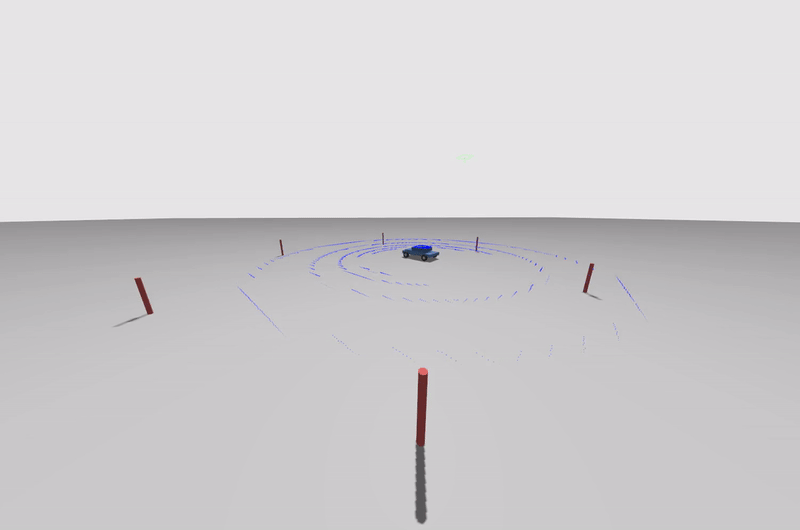
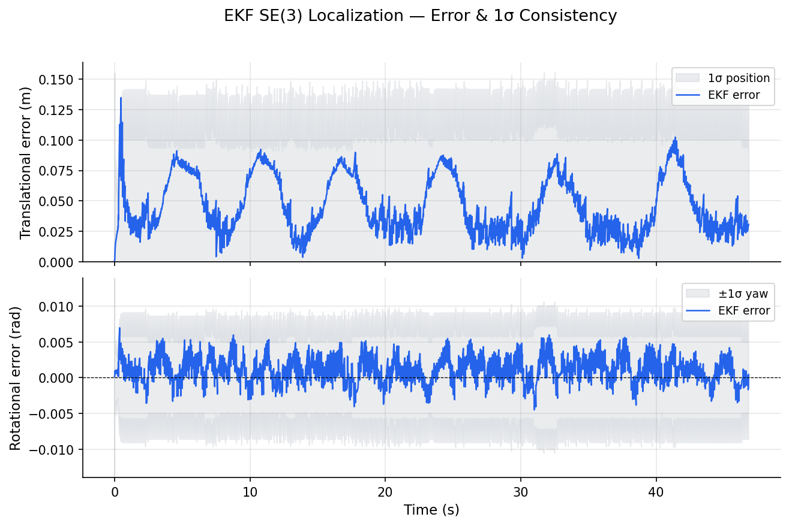

# EKF SE(3) Map-Based Localization

A ROS2 Humble C++ implementation of Extended Kalman Filter localization on the Lie group SE(3). A simulated differential-drive car uses a VLP-16 style LiDAR to detect known landmark poles; the EKF uses velocity commands for dead reckoning and corrects against LiDAR detections to estimate its 6-DOF pose.

---

## Demo

<p align="center">
  <b>Gazebo — car driving a circle around the beacon poles</b><br>
  
</p>


<p align="center">
  <b>Error & 1σ consistency — translational and rotational error vs ground truth</b><br>
  
</p>

---

---

## Table of Contents

1. [Overview](#1-overview)
2. [Mathematical Background](#2-mathematical-background)
3. [System Model](#3-system-model)
4. [EKF Algorithm](#4-ekf-algorithm) — including [§4.3 Numerical Stability on SE(3)](#43-numerical-stability-on-se3)
5. [Sensor Model](#5-sensor-model) — including [§5.4 RANSAC Outlier Rejection](#54-ransac-outlier-rejection)
6. [Simulation Architecture](#6-simulation-architecture)
7. [Running the Simulation](#7-running-the-simulation)
8. [Tuning Guide](#8-tuning-guide)
- [Appendix A — Derivation of F](#appendix-a--derivation-of-f)
- [Appendix B — Derivation of H](#appendix-b--derivation-of-h)

---

## 1. Overview

Standard EKF localization represents the robot pose as a vector in $\mathbb{R}^n$. For a full 6-DOF vehicle this breaks down because rotation is not a vector space — two rotations do not add, and Euler-angle parameterisations have singularities (gimbal lock) where the EKF's Gaussian covariance becomes ill-conditioned.

**SE(3) localization** avoids these problems by working directly on the Lie group of rigid-body transformations:

$$
SE(3) = \left\lbrace \mathbf{T} = \begin{bmatrix} \mathbf{R} & \mathbf{t} \\\\ \mathbf{0} & 1 \end{bmatrix} \in \mathbb{R}^{4 \times 4} \middle| \mathbf{R} \in SO(3), \mathbf{t} \in \mathbb{R}^3 \right\rbrace
$$

Pose uncertainty is represented as a Gaussian distribution in the **Lie algebra** $se(3) \cong \mathbb{R}^6$ via the right-perturbation model, and all filter operations respect the group structure.

> **Notation:** This document follows the conventions of the
> [SLAM Handbook](https://github.com/SLAM-Handbook-contributors/slam-handbook-public-release)
> (Cambridge University Press). See the notation legend at the start of Section 2.

---

## 2. Mathematical Background

### Notation Legend

| Symbol | Meaning |
|--------|---------|
| $\mathbf{T}$ | True (unknown) SE(3) pose — what the filter is trying to estimate |
| $\hat{\mathbf{T}}$ | Posterior pose estimate (after correction); hat denotes posterior |
| $\bar{\mathbf{T}}$ | Prior pose estimate (after prediction, before correction); bar denotes prior |
| $\boldsymbol{\xi}$ | Lie algebra element $\boldsymbol{\xi} = [\boldsymbol{\rho}; \boldsymbol{\theta}] \in \mathbb{R}^6$ (translational + rotational) |
| $(\cdot)^\wedge$ | Wedge operator: maps $\boldsymbol{\xi} \in \mathbb{R}^6$ to the $4\times4$ matrix Lie algebra element |
| $(\cdot)^\vee$ | Vee operator: inverse of wedge, extracts $\boldsymbol{\xi} \in \mathbb{R}^6$ from a matrix |
| $\text{Exp}(\boldsymbol{\xi})$ | Matrix exponential shorthand: $\text{Exp}(\boldsymbol{\xi}) := \exp(\boldsymbol{\xi}^\wedge) \in SE(3)$ |
| $\text{Log}(\mathbf{T})$ | Matrix logarithm shorthand: $\text{Log}(\mathbf{T}) := \ln(\mathbf{T})^\vee \in \mathbb{R}^6$ |
| $\bar{\mathbf{T}} \oplus \boldsymbol{\delta}$ | Right-composition: $\bar{\mathbf{T}} \cdot \text{Exp}(\boldsymbol{\delta}) \in SE(3)$ |
| $\mathbf{T} \ominus \mathbf{T}^0$ | Log difference: $\text{Log}((\mathbf{T}^0)^{-1} \cdot \mathbf{T}) \in \mathbb{R}^6$ |
| $\boldsymbol{\Sigma}$ | $6\times6$ covariance of right-perturbation $\boldsymbol{\delta} \in \mathbb{R}^6$ |
| $\text{Ad}(\mathbf{T})$ | $6\times6$ Adjoint matrix of $\mathbf{T}$ |
| $\mathbf{p}^\wedge$ | Skew-symmetric matrix of $\mathbf{p} \in \mathbb{R}^3$ (same as $\mathbf{p}^\times$; wedge notation for 3-vectors) |

---

### 2.1 SE(3) as a Lie Group

SE(3) is the group of $4\times4$ homogeneous transformation matrices. Composition is matrix multiplication; inversion is:

$$\mathbf{T}^{-1} = \begin{bmatrix} \mathbf{R}^\top & -\mathbf{R}^\top \mathbf{t} \\\\ \mathbf{0} & 1 \end{bmatrix}$$

The group acts on 3D points via $\mathbf{T} \cdot \mathbf{p} = \mathbf{R}\mathbf{p} + \mathbf{t}$.

### 2.2 Lie Algebra se(3)

The Lie algebra $se(3)$ is the tangent space at the identity. Each element is a 6-vector:

$$
\boldsymbol{\xi} = \begin{bmatrix} \boldsymbol{\rho} \\\\ \boldsymbol{\theta} \end{bmatrix} \in \mathbb{R}^6, \qquad \boldsymbol{\rho} \in \mathbb{R}^3 \text{ (translational)},\quad \boldsymbol{\theta} \in \mathbb{R}^3 \text{ (rotational)}
$$

with the wedge map $(\cdot)^\wedge$ to $4\times4$ matrices:

$$
\boldsymbol{\xi}^\wedge = \begin{bmatrix} \boldsymbol{\theta}^\wedge & \boldsymbol{\rho} \\\\ \mathbf{0} & 0 \end{bmatrix}
$$

where $\boldsymbol{\theta}^\wedge$ is the $3\times3$ skew-symmetric matrix of $\boldsymbol{\theta}$. The inverse vee map $(\cdot)^\vee$ extracts $\boldsymbol{\xi}$ back:

$$(\boldsymbol{\xi}^\wedge)^\vee = \boldsymbol{\xi}$$

### 2.3 Exponential and Logarithm Maps

$$\text{Exp} : \mathbb{R}^6 \to SE(3), \qquad \text{Exp}(\boldsymbol{\xi}) := \exp(\boldsymbol{\xi}^\wedge) \quad \text{(matrix exponential of the wedge)}$$

$$\text{Log} : SE(3) \to \mathbb{R}^6, \qquad \text{Log}(\mathbf{T}) := \ln(\mathbf{T})^\vee \quad \text{(matrix logarithm + vee)}$$

For small $\boldsymbol{\xi}$: $\text{Exp}(\boldsymbol{\xi}) \approx \mathbf{I} + \boldsymbol{\xi}^\wedge$.

In code: `Sophus::SE3d::exp(xi)` and `T.log()`.

### 2.4 Right-Perturbation Convention

The **true** (unknown) pose $\mathbf{T}$ and its **estimate** $\hat{\mathbf{T}}$ are related by a small right-sided perturbation $\boldsymbol{\delta} \in \mathbb{R}^6$:

$$\mathbf{T} = \hat{\mathbf{T}} \oplus \boldsymbol{\delta} := \hat{\mathbf{T}} \cdot \text{Exp}(\boldsymbol{\delta}), \qquad \boldsymbol{\delta} \in \mathbb{R}^6 \text{ small}$$

- $\mathbf{T}$ is the **true** pose — it exists in reality but is not directly observable.
- $\hat{\mathbf{T}}$ is the **estimated** pose — what the filter maintains and updates.
- $\boldsymbol{\delta}$ is the error living in the **body frame** of the estimate.

The covariance $\boldsymbol{\Sigma} \in \mathbb{R}^{6\times6}$ is the covariance of this right-perturbation:

$$\boldsymbol{\delta} \sim \mathcal{N}(\mathbf{0}, \boldsymbol{\Sigma})$$

The $\oplus$ / $\ominus$ operators from the SLAM Handbook:

$$\mathbf{T} \oplus \boldsymbol{\xi} := \mathbf{T} \cdot \text{Exp}(\boldsymbol{\xi}) \qquad \text{(right-compose with exponential)}$$

$$\mathbf{T} \ominus \mathbf{T}^0 := \text{Log}\left((\mathbf{T}^0)^{-1} \cdot \mathbf{T}\right) \qquad \text{(log difference — yields } \boldsymbol{\xi} \in \mathbb{R}^6\text{)}$$

### 2.5 Adjoint Representation

The Adjoint maps body-frame perturbations to world-frame perturbations:

$$
\text{Ad}(\mathbf{T}) : \mathbb{R}^6 \to \mathbb{R}^6, \qquad \text{Ad}(\mathbf{T}) = \begin{bmatrix} \mathbf{R} & \mathbf{t}^\wedge \mathbf{R} \\\\ \mathbf{0} & \mathbf{R} \end{bmatrix} \in \mathbb{R}^{6\times6}
$$

It satisfies the identity:

$$\mathbf{T} \cdot \text{Exp}(\boldsymbol{\xi}) = \text{Exp}(\text{Ad}(\mathbf{T}) \cdot \boldsymbol{\xi}) \cdot \mathbf{T}$$

This identity is used to propagate the covariance through the motion model (see Section 4.1).

In code: `Sophus::SE3d T; T.Adj()`.

### 2.6 Skew-Symmetric Matrix (Wedge of a 3-vector)

For $\mathbf{p} \in \mathbb{R}^3$, the wedge $\mathbf{p}^\wedge$ (equivalent to $\mathbf{p}^\times$) satisfies $\mathbf{p}^\wedge \mathbf{v} = \mathbf{p} \times \mathbf{v}$:

$$
\mathbf{p}^\wedge = \begin{bmatrix} 0 & -p_z & p_y \\\\ p_z & 0 & -p_x \\\\ -p_y & p_x & 0 \end{bmatrix}
$$

This appears in the measurement Jacobian (Section 4.2) when differentiating the rotation action on a point.

---

## 3. System Model

### 3.1 State

The filter maintains two quantities:

$$\hat{\mathbf{T}} \in SE(3) \qquad \text{posterior pose estimate (rotation + translation)}$$

$$\boldsymbol{\Sigma} \in \mathbb{R}^{6\times6} \qquad \text{covariance of right-perturbation } \boldsymbol{\delta} = [\delta\boldsymbol{\rho}; \delta\boldsymbol{\theta}]$$

$\mathbf{T}$ denotes the **true** pose the filter is trying to track. At all times $\mathbf{T} \approx \hat{\mathbf{T}} \oplus \boldsymbol{\delta}$ with $\boldsymbol{\delta} \sim \mathcal{N}(\mathbf{0}, \boldsymbol{\Sigma})$.

### 3.2 Motion Model

The true pose evolves as:

$$\mathbf{T}_i = \mathbf{T}_{i-1} \cdot \text{Exp}(\mathbf{u}_i \cdot dt + \mathbf{w})$$

- $\mathbf{u}_i \in \mathbb{R}^6$ — body-frame velocity command from `/cmd_vel` (the control input in the classical EKF sense). For a non-holonomic differential-drive car only $v_x$ and $\omega_z$ are commanded: $\mathbf{u}_i = [v_x, 0, 0, 0, 0, \omega_z]^\top$. $\mathbf{Q}$ captures the uncertainty between this command and what the car actually does (actuator noise, wheel slip, kinematic model error).
- $\mathbf{w} \sim \mathcal{N}(\mathbf{0}, \mathbf{Q})$ — process noise (perturbation in $se(3)$)
- $dt$ — time step in seconds

**Interpretation:** the car moves by composing its current pose with the exponential of the velocity command, plus noise. The exponential map ensures the result stays on SE(3).

The filter only has access to the velocity command $\mathbf{u}_i$; the true state $\mathbf{T}_i$ is not observed directly.

### 3.3 Measurement Model

$$\mathbf{y}_k = h(\mathbf{T}) = \mathbf{T}^{-1} \cdot \mathbf{b}_k + \mathbf{v}$$

- $\mathbf{b}_k \in \mathbb{R}^3$ — known beacon position in world frame (the map)
- $\mathbf{y}_k \in \mathbb{R}^3$ — observed beacon position in robot body frame
- $\mathbf{v} \sim \mathcal{N}(\mathbf{0}, \mathbf{R})$ — measurement noise (LiDAR ranging + centroid error)

**Interpretation:** the LiDAR sees beacon $k$ at position $\mathbf{y}_k$ in the robot frame. If the estimate were exact ($\hat{\mathbf{T}} = \mathbf{T}$), the predicted measurement would be $\hat{\mathbf{T}}^{-1} \mathbf{b}_k$. The difference is the innovation.

---

## 4. EKF Algorithm

### 4.1 Prediction Step

**Mean propagation** (exact, on manifold):

$$\bar{\mathbf{T}}_i = \hat{\mathbf{T}}_{i-1} \cdot \text{Exp}(\mathbf{u} \cdot dt)$$

$\hat{\mathbf{T}}_{i-1}$ is the posterior from the previous step; $\bar{\mathbf{T}}_i$ is the new prior (before any correction this step).

**Jacobian F** (linearised motion w.r.t. right perturbation):

In a Euclidean EKF, $\mathbf{F} = \partial f / \partial \mathbf{x}$ — a derivative with respect to the state vector. On SE(3) this is undefined because $\mathbf{T}$ is a $4\times4$ matrix, not a vector; the correct analog is the derivative of the output perturbation with respect to the input perturbation, both in $\mathbb{R}^6$. The result, derived via the Adjoint identity (see [Appendix A](#appendix-a--derivation-of-f), or \[1\] §IV and \[2\] §Foundations):

$$\mathbf{F} = \text{Ad}(\text{Exp}(-\mathbf{u} \cdot dt)) \in \mathbb{R}^{6\times6}$$

**Interpretation:** a body-frame perturbation $\boldsymbol{\delta}_{i-1}$ at the old pose, after the car moves by $\text{Exp}(\mathbf{u} \cdot dt)$, lands in a different body frame at the new pose. $\mathbf{F}$ rotates that perturbation from the old body frame into the new one.

In code:
```cpp
Matrix6d F = Sophus::SE3d::exp(-u_dt).Adj();
```

**Covariance propagation** ($\mathbf{w}$ enters directly in $se(3)$, so $\mathbf{G} = \mathbf{I}$):

$$\bar{\boldsymbol{\Sigma}}_i = \mathbf{F} \boldsymbol{\Sigma}_{i-1} \mathbf{F}^\top + \mathbf{Q}$$

$\boldsymbol{\Sigma}_{i-1}$ is the posterior covariance from the previous step; $\bar{\boldsymbol{\Sigma}}_i$ is the prior covariance after prediction. At time 0, $\boldsymbol{\Sigma}_0$ is set by `P0_diag` in params.yaml.

### 4.2 Correction Step (per beacon k)

Corrections are applied sequentially, one beacon at a time. For the first beacon the inputs are the prior T_bar and Sigma_bar from Section 4.1. For each subsequent beacon, the posterior from the previous correction becomes the new input. So if three beacons are detected:

$$(\bar{\mathbf{T}}_i, \bar{\boldsymbol{\Sigma}}_i) \overset{b_1}{\to} (\hat{\mathbf{T}}_1, \boldsymbol{\Sigma}_1) \overset{b_2}{\to} (\hat{\mathbf{T}}_2, \boldsymbol{\Sigma}_2) \overset{b_3}{\to} (\hat{\mathbf{T}}_3, \boldsymbol{\Sigma}_3)$$

The final posterior is carried forward as the prior for the next prediction step. This sequential update is mathematically equivalent to a single joint correction when measurement noises are independent, which they are here since each beacon's LiDAR returns are independent.

The equations below use T_bar and Sigma_bar as the inputs for brevity, but in practice these refer to whatever the current estimate is at the start of each individual beacon correction.

**Predicted measurement:**

$$\mathbf{p} = \bar{\mathbf{T}}_i^{-1} \cdot \mathbf{b}_k \in \mathbb{R}^3$$

**Innovation:**

$$\mathbf{z}_k = \mathbf{y}_k - \mathbf{p} \in \mathbb{R}^3$$

**Measurement Jacobian H** ($3\times6$, derived in [Appendix B](#appendix-b--derivation-of-h)):

$$\mathbf{H} = \begin{bmatrix} -\mathbf{I}_3 & \mathbf{p}^\wedge \end{bmatrix} \in \mathbb{R}^{3\times6}$$

**Innovation covariance:**

$$\mathbf{S}_k = \mathbf{H} \bar{\boldsymbol{\Sigma}}_i \mathbf{H}^\top + \mathbf{R} \in \mathbb{R}^{3\times3}$$

**Kalman gain:**

$$\mathbf{K} = \bar{\boldsymbol{\Sigma}}_i \mathbf{H}^\top \mathbf{S}_k^{-1} \in \mathbb{R}^{6\times3}$$

**State update** (on manifold — right-compose the prior with the correction):

$$\hat{\mathbf{T}}_i = \bar{\mathbf{T}}_i \cdot \text{Exp}(\mathbf{K} \mathbf{z}_k)$$

If $\mathbf{z}_k = \mathbf{0}$ (saw beacon exactly where predicted), $\text{Exp}(\mathbf{0}) = \mathbf{I}$ and the pose is unchanged.

**Covariance update:**

$$\boldsymbol{\Sigma}_i = \bar{\boldsymbol{\Sigma}}_i - \mathbf{K}\mathbf{S}_k\mathbf{K}^\top$$

---

### 4.3 Numerical Stability on SE(3)

Two bookkeeping steps prevent floating-point drift from corrupting the manifold structure.

**SO(3) renormalization.** Sophus represents the rotation component of `SE3d` internally as a unit quaternion. Repeated floating-point multiplications in `predict()` and `correct()` accumulate rounding error that causes the norm to drift away from 1 by $O(\varepsilon_\text{mach})$ per step. Over hundreds of steps this drift makes $\mathbf{R}\mathbf{R}^\top \neq \mathbf{I}$, which corrupts the Adjoint $\text{Ad}(\mathbf{T})$ and therefore the predicted covariance.

After each predict and correct call:

```cpp
X_.so3().normalize();   // re-projects the internal rotation back onto SO(3)
```

**Covariance symmetry enforcement.** The Joseph form keeps $\boldsymbol{\Sigma}$ positive-definite, but arithmetic still accumulates a tiny asymmetry $O(\varepsilon_\text{mach})$ in the off-diagonal pairs $(\Sigma_{ij}, \Sigma_{ji})$. After every correction:

```cpp
P_ = 0.5 * (P_ + P_.transpose());
```

This replaces each pair with their average, eliminating the asymmetry exactly. Without it, operations that assume exact symmetry — such as LDLT decomposition and the eigenvalue analysis used by RViz to draw the covariance ellipse — can produce incorrect or complex results.

---

## 5. Sensor Model

### 5.1 LiDAR Centroid Extraction

The 3D LiDAR (VLP-16 style, 16 channels, ±15° vertical, 360° horizontal) scans at 10 Hz. Beacon poles are thin cylinders (radius 0.05 m, height 2 m) — the LiDAR returns points on their surface.

The EKF correction step assumes each measurement $\mathbf{y}_k$ is already paired with its corresponding beacon $\mathbf{b}_k$. Determining that pairing from raw point cloud data is the **data association** problem. For this simulation, a nearest-neighbour approach is used: the ground truth pose is used to predict where each beacon should appear in the body frame. LiDAR points are then clustered around that predicted location. This is not part of the filter — it happens before the measurement reaches the EKF.

For each beacon $\mathbf{b}_k$, the detector node:

1. Projects beacon $\mathbf{b}_k$ to body frame using the ground truth pose:

   $$\mathbf{p}\_\text{pred} = \mathbf{T}\_\text{ref}^{-1} \cdot \mathbf{b}_k$$

2. Collects all cloud points within `cluster_radius = 0.7 m` of $\mathbf{p}\_\text{pred}$
3. If ≥ `min_cluster_pts = 1` points found, computes centroid: $\mathbf{y}_k = \text{mean(cluster)}$

An alternative would be to run a separate EKF correction for each individual LiDAR point. This is avoided for three reasons. First, points on the same pole are highly correlated — they are all noisy observations of the same physical object — so treating them as independent measurements overstates the information content and causes $\boldsymbol{\Sigma}$ to shrink too aggressively. Second, the centroid is a sufficient statistic for the pole centre under isotropic noise: the mean carries the same positional information as the individual points. Third, running a full correction (computing $\mathbf{H}$, $\mathbf{S}_k$, $\mathbf{K}$, and updating $\hat{\mathbf{T}}$ and $\boldsymbol{\Sigma}$) for every point would multiply the computational cost by the cluster size (10–20x per beacon) for negligible gain.

### 5.2 Why Thin Poles Reduce Bias

When a LiDAR scans a cylinder it can only hit the surface facing it — the far side is occluded. The returned points therefore form a partial arc on the near side, not a full ring around the pole. The centroid of that partial arc is not at the pole's central axis but shifted toward the sensor by approximately $r/2$.

This matters because the measurement model assumes $\mathbf{y}_k$ is a noisy observation of the pole centre. A systematic offset from the centre is a bias — a consistent error the filter cannot distinguish from a pose error, causing it to shift the pose estimate in the wrong direction.

For a thick pole (say $r = 0.5$ m) the bias would be ~25 cm, which would seriously corrupt the estimate. For our thin poles ($r = 0.05$ m) the bias is only ~2.5 cm — small enough relative to the ranging noise (~1.5 cm standard deviation) that the filter absorbs it into $\mathbf{R}$ rather than treating it as a pose error.

**Point landmark vs. surface model.** Treating $\mathbf{b}_k$ as a single 3D point (the pole centre) rather than a cylinder with physical extent is a deliberate modelling simplification. A more accurate model would represent the pole as a cylinder and derive a measurement function mapping the robot pose to expected LiDAR returns on the surface, but this would require a significantly more complex $\mathbf{H}$ and data model. The point approximation is valid here because the poles are thin — the bias is small enough to be absorbed into $\mathbf{R}$.

Point landmarks are widely used in real localization and SLAM systems. Whether the approximation holds depends on the landmark type: narrow poles, corner reflectors, and keypoints extracted from edges are all well-suited to the point model. Wide pillars, flat walls, or curved surfaces would require a plane or surface model instead, because the offset between the true surface and the assumed point centre would be too large to absorb into noise.

### 5.3 Effective R Matrix

Each individual LiDAR range measurement has a noise standard deviation of $\sigma_\text{range} \approx 0.015$ m. When averaging $n$ independent noisy measurements the noise on the mean reduces by $\sqrt{n}$ — the standard error of the mean. With 15 returns per pole this gives a theoretical centroid noise of:

$$\sigma_\text{centroid} \approx \frac{\sigma_\text{range}}{\sqrt{n}} \approx \frac{0.015}{\sqrt{15}} \approx 0.004 \text{ m}$$

However, the returns on a single pole are not perfectly independent — they all hit the same curved surface, so angular discretisation of the LiDAR scan and the pole geometry introduce additional correlated error. In practice this adds ~1–3 cm, making the real centroid noise closer to 1–3 cm rather than 0.4 cm.

$\mathbf{R}$ is set to $\text{diag}(0.04, 0.04, 0.04)$, corresponding to a standard deviation of 0.2 m — deliberately much larger than the actual noise. This conservatism means the filter trusts the LiDAR less than it theoretically could, making it more robust to the modelling approximations (centroid bias, correlated returns, unmodelled pole geometry). Setting $\mathbf{R}$ too small would make the filter overconfident in the measurements and potentially cause the covariance to collapse to zero, after which the filter stops correcting.

### 5.4 RANSAC Outlier Rejection

#### Why the standard EKF is fragile to outliers

The EKF correction step treats every received measurement as a valid draw from the assumed Gaussian noise model $\mathbf{v} \sim \mathcal{N}(\mathbf{0}, \mathbf{R})$. Crucially, the covariance update

$$\boldsymbol{\Sigma}_{i} = \boldsymbol{\Sigma}_{i-1} - \mathbf{K}_k \mathbf{Z}_k \mathbf{K}_k^\top$$

**always decreases** $\boldsymbol{\Sigma}$ regardless of whether the measurement was correct. This creates a dangerous failure mode: a single bad measurement (e.g., a LiDAR ghost return at 17–19 m range producing a false centroid far from the true beacon centre) is accepted by the filter as highly informative evidence. The state $\hat{\mathbf{T}}$ is pulled in the wrong direction, and simultaneously $\boldsymbol{\Sigma}$ shrinks — signalling high confidence in the wrong answer. With small covariance, subsequent corrections from the remaining good beacons are down-weighted by the Kalman gain, so the filter cannot self-recover. The covariance not growing at the divergence point is the distinguishing symptom of a corrupted-but-confident filter.

A simple innovation threshold (reject if $\|\mathbf{z}_k\| > \tau$) would address this, but it is a heuristic: the same threshold that rejects a bad measurement at one operating point may reject a valid large correction after a period of dead-reckoning. A more principled approach is RANSAC.

#### RANSAC algorithm

RANSAC (Random Sample Consensus) finds the largest subset of measurements that are mutually consistent with a single pose hypothesis, and discards the rest as outliers.

**Model:** the robot pose $\hat{\mathbf{T}} \in SE(3)$.

**Minimal sample:** one beacon measurement. A single body-frame measurement $\mathbf{y}_k$ provides three constraints on the six-DOF pose. Rather than solving the underdetermined system analytically, the standard Kalman correction is used as the hypothesis generator — it produces the maximum-likelihood pose update given beacon $k$ alone, leaving the unconstrained directions unchanged:

$$\hat{\mathbf{T}}_{\text{hyp},k} = \hat{\mathbf{T}} \cdot \text{Exp}\left(\mathbf{K}_k \mathbf{z}_k\right)$$

where $\mathbf{K}_k = \boldsymbol{\Sigma}\mathbf{H}_k^\top(\mathbf{H}_k\boldsymbol{\Sigma}\mathbf{H}_k^\top + \mathbf{R})^{-1}$ is the standard Kalman gain for beacon $k$.

**Inlier test:** beacon $j$ is an inlier at hypothesis $k$ if its residual at the hypothetical pose is below a threshold $\tau$:

$$\left\|\mathbf{y}_j - \hat{\mathbf{T}}_{\text{hyp},k}^{-1}\mathbf{b}_j\right\| < \tau$$

**Consensus:** with $N$ detected beacons, the algorithm evaluates $N$ hypotheses (one per beacon). The hypothesis with the most inliers wins, and EKF corrections are applied only for those inlier beacons.

```
for each detected beacon i:
    X_hyp  = hypothetical_pose(b_i, y_i)   // single-beacon Kalman update
    inliers = []
    for each detected beacon j:
        if ||y_j - X_hyp⁻¹ · b_j|| < τ:
            inliers.append(j)
    if len(inliers) > best:
        best_inliers = inliers

for k in best_inliers:
    EKF.correct(b_k, y_k)
```

The total cost is $O(N^2)$ — for $N = 6$ beacons this is 36 operations, negligible at 10 Hz.

**Key property:** an outlier beacon can only win the RANSAC vote if it generates a hypothesis that coincidentally explains all other beacons too — which a random ghost return essentially never does. One bad measurement loses the vote 1-vs-5 and is silently dropped. The covariance is never touched by the outlier, so the filter's self-reported uncertainty remains honest.

#### Parameter

| Parameter | Default | Meaning |
|-----------|---------|---------|
| `ransac_inlier_thresh` | 0.5 m | Maximum body-frame residual for a beacon to be counted as an inlier. Tighten if outliers still pass; loosen if valid detections at long range are incorrectly rejected. |

The threshold is set in `params.yaml` and takes effect at the next launch without recompiling.

---

## 6. Simulation Architecture

### 6.1 Node Graph

```
                     Gz Fortress
          ┌─────────────────────────────────┐
          │                                 │
          │  diff_drive_plugin              │──► /odom  (nav_msgs/Odometry)
          │  gz_ground_truth                │──► /ground_truth/odom
          │  gpu_lidar                      │──► /lidar/points  (PointCloud2)
          │                                 │
          └────────────────▲────────────────┘
                           │ /cmd_vel (Twist)
                           │                   ╲
                    ┌──────┴──────┐              ╲ /cmd_vel (u_i — control input)
                    │ figure8_node│  open-loop    ╲
                    └─────────────┘  circle        ▼
                                              ekf_node

/lidar/points ──► lidar_beacon_detector_node ──► /beacons_detected (PoseArray) ──► ekf_node
/ground_truth/odom ──► ↑ (GT used for cluster search; raw LiDAR centroid is the measurement)
/odom              ──► ↑ (odometry fallback for cluster search)
/ekf/pose          ──► ↑ (EKF estimate fallback for cluster search)
                    └──► /beacon_clusters (PointCloud2) ──► RViz

/cmd_vel           ──► ekf_node ──► /ekf/pose  (PoseWithCovarianceStamped)
/beacons_detected  ──►           ──► /ekf/path  (Path)
/ground_truth/odom ──►           ──► /ekf/error (Vector3Stamped)
                                     TF: map → base_link
```

**GT bootstrap.** On the very first `/ground_truth/odom` message the EKF resets its pose to the true car position (and resets $\boldsymbol{\Sigma}$ to $\mathbf{P}_0$). After that, ground truth is used only for error reporting — never again fed into the filter. This one-shot bootstrap eliminates the startup transient that would otherwise arise from the EKF's `init_translation` default being wrong relative to where Gazebo actually placed the car. All prediction and correction steps thereafter use only `/cmd_vel` and `/beacons_detected`.

### 6.2 Topic Reference

| Topic | Type | Publisher | Subscriber(s) |
|-------|------|-----------|---------------|
| `/cmd_vel` | `Twist` | `figure8_node` | Gazebo, `ekf_node` |
| `/odom` | `Odometry` | Gazebo (diff_drive) | `lidar_beacon_detector_node` |
| `/ground_truth/odom` | `Odometry` | Gazebo (p3d) | `ekf_node` (error only), `lidar_beacon_detector_node` (data association) |
| `/lidar/points` | `PointCloud2` | Gazebo (ray sensor) | `lidar_beacon_detector_node` |
| `/beacons_detected` | `PoseArray` | `lidar_beacon_detector_node` | `ekf_node` |
| `/beacon_clusters` | `PointCloud2` | `lidar_beacon_detector_node` | RViz |
| `/ekf/pose` | `PoseWithCovarianceStamped` | `ekf_node` | RViz, `lidar_beacon_detector_node` (data association fallback) |
| `/ekf/path` | `Path` | `ekf_node` | RViz |
| `/ekf/error` | `Vector3Stamped` | `ekf_node` | rqt_plot |

---

## 7. Running the Simulation

### Step 1 — Install dependencies

Requires **Ubuntu 22.04** with **ROS2 Humble** already installed. If you haven't set up ROS2 yet, follow the [official guide](https://docs.ros.org/en/humble/Installation.html) first.

```bash
# ROS2 Humble base + Gz Fortress
sudo apt update
sudo apt install ros-humble-desktop \
                 ros-humble-ros-gz-sim \
                 ros-humble-ros-gz-bridge \
                 ros-humble-sophus \
                 ros-humble-nav-msgs \
                 ros-humble-sensor-msgs \
                 ros-humble-tf2-eigen \
                 python3-colcon-common-extensions
```

> **Note:** `ros-humble-sophus` depends on `libunwind-dev`, which conflicts with `libunwind-14-dev`. If the install fails with an unmet dependencies error, run:
> ```bash
> sudo apt remove libunwind-14-dev
> sudo apt install ros-humble-sophus
> ```

Verify Gz Fortress is available:
```bash
ign gazebo --version
# Expected: Gazebo Sim, version 6.x.x
```

### Step 2 — Navigate to your workspace

Run all subsequent commands from the directory that contains the `ekf_se3_localization` folder:

```bash
cd /path/to/your/workspace   # e.g. ~/Robotics
```

### Step 3 — Build

```bash
cd ~/RoboticsTutorials
source /opt/ros/humble/setup.bash
colcon build --packages-select ekf_se3_localization \
             --cmake-args -DCMAKE_BUILD_TYPE=RelWithDebInfo
```

Expected output:
```
Starting >>> ekf_se3_localization
Finished <<< ekf_se3_localization [~30s]

Summary: 1 package finished
```

If the build fails, the most common cause is a missing `sophus` package — re-run `sudo apt install ros-humble-sophus` and try again.

### Step 4 — Source the workspace

You must do this in **every new terminal** before running any ROS2 commands for this package:

```bash
source ~/RoboticsTutorials/install/setup.bash
```

> Tip: add this line to your `~/.bashrc` so it runs automatically:
> `echo "source ~/RoboticsTutorials/install/setup.bash" >> ~/.bashrc`

### Step 5 — Launch the simulation

```bash
ros2 launch ekf_se3_localization simulation.launch.py
```

**What happens in sequence:**
1. **Gazebo** opens showing a flat world with 6 red beacon poles arranged in a ring (radius 15 m centred at (0, 7), spaced 60° apart)
2. After ~5 seconds the **blue car** spawns at the origin
3. The car immediately begins driving a **circle** (no input needed)
4. **RViz** opens alongside Gazebo showing the paths

### Step 6 — Read the RViz display

RViz launches in top-down view. You will see:

| Colour | Display | What it shows |
|--------|---------|---------------|
| **Blue** | `/ekf/path` + covariance ellipse | EKF pose estimate $\hat{\mathbf{T}}$ — should track green |
| **Green** | `/ground_truth/odom` | True Gazebo physics pose $\mathbf{T}$ |
| **Orange dots** | `/beacon_clusters` | LiDAR points collected around each beacon pole |

**What good behaviour looks like:**
- Blue path stays close to green path
- The covariance ellipse (blue oval around the car pose) shrinks when the car is near a beacon pole, grows slightly when driving in open space between detections
- Orange clusters appear on the beacon poles as the car passes within LiDAR range (20 m); opposite-side beacons drop out of view each lap

### Step 7 — Monitor the error signal

Open a second terminal (source the workspace first), then:

```bash
# Print raw error values
ros2 topic echo /ekf/error
```

Each message shows:
- `vector.x` — translational error in metres ($\|\mathbf{t}_\text{ekf} - \mathbf{t}_\text{gt}\|$)
- `vector.y` — yaw error in radians

For a live plot:
```bash
rqt_plot /ekf/error/vector/x
```

**Expected behaviour:** error starts high (~0.5–1 m from initial covariance), drops sharply within the first ~10 seconds as beacon corrections arrive, then stays bounded below ~0.2 m for the rest of the run. The raw odometry error (if you plotted it) would grow without bound.

### Step 8 — Verify each node is running

In a second terminal:
```bash
ros2 node list
```
Expected:
```
/ekf_node
/figure8_node
/gazebo
/lidar_beacon_detector_node
/rviz2
```

Check topics are publishing:
```bash
ros2 topic hz /lidar/points          # ~10 Hz
ros2 topic hz /beacons_detected      # ~10 Hz (only when poles in range)
ros2 topic hz /ekf/pose              # ~50 Hz
ros2 topic hz /ground_truth/odom     # ~50 Hz
```

### Step 9 — Stop the simulation

Press `Ctrl+C` in the terminal where you ran `ros2 launch`. All nodes and Gazebo will shut down together.


### Optional — Record a bag for later analysis

```bash
ros2 bag record /ekf/pose /ekf/path /ekf/error /odom /ground_truth/odom -o ekf_run_1
```

Play it back offline:
```bash
ros2 bag play ekf_run_1
```

---


### Generating the error plot (`docs/ekf_error_plot.png`)

Record a bag while the simulation is running:

```bash
ros2 bag record /ekf/error /ekf/pose -o ~/ekf_data
```

Then generate the plot:

```bash
python3 scripts/plot_ekf_error.py ~/ekf_data
```

Output is written to `docs/ekf_error_plot.png` automatically.

---

## 8. Tuning Guide

### Process Noise Q

`Q_diag = [ρx, ρy, ρz, θx, θy, θz]`

- **Increase Q** → filter trusts motion model less, corrections have more influence, $\boldsymbol{\Sigma}$ stays larger → more responsive to beacon detections but noisier between them
- **Decrease Q** → filter trusts odometry more, smoother trajectory but slower to correct accumulated drift
- For a near-planar car: set `ρz`, `θx`, `θy` close to 0 (the car doesn't bounce or roll much)

### Measurement Noise R

`R_diag = [σx², σy², σz²]`

- **Increase R** → filter trusts LiDAR less → slower convergence, more odometry drift
- **Decrease R** → filter trusts LiDAR more → faster convergence but susceptible to outliers
- Should match actual LiDAR centroid noise (see Section 5.3). Mismatch by 5× is usually tolerable

### Initial Covariance $\boldsymbol{\Sigma}_0$

`P0_diag = [ρx, ρy, ρz, θx, θy, θz]`

Current values (from `config/params.yaml`):

```yaml
P0_diag: [0.01, 0.01, 0.001, 0.001, 0.001, 0.01]
```

| Component | Value (m² or rad²) | $\sigma$ | Rationale |
|-----------|-------------------|---------|-----------|
| $\rho_x, \rho_y$ | 0.01 | 0.1 m | GT bootstrap places EKF at the true position; 10 cm initial uncertainty is generous |
| $\rho_z$ | 0.001 | 0.032 m | Planar car — vertical position nearly known from physics |
| $\theta_x, \theta_y$ | 0.001 | 0.032 rad ≈ 1.8° | Planar car — roll and pitch are near zero at all times |
| $\theta_z$ | 0.01 | 0.1 rad ≈ 5.7° | Small initial heading uncertainty (car spawns aligned with +x) |

**Why P0 is small here.** The GT bootstrap (Section 6.1) resets the EKF pose to the Gazebo ground-truth position at startup, so the actual initial error is near zero. A small $\boldsymbol{\Sigma}_0$ reflects this: the initial Kalman gains $\mathbf{K} \propto \boldsymbol{\Sigma}_0$ are small, meaning the first beacon corrections make only modest adjustments rather than large jumps. $\boldsymbol{\Sigma}$ then grows naturally through the prediction step (each step adds $\mathbf{Q}$) until the filter uncertainty has grown to a realistic level.

If you remove the GT bootstrap — for example to test recovery from a wrong initial pose — set `P0_diag` to values that reflect your actual initial uncertainty (e.g., `[1.0, 1.0, 0.1, 0.1, 0.1, 0.5]`) so the initial Kalman gains are large enough for the filter to converge quickly on the first beacon fix.

- **Large $\boldsymbol{\Sigma}_0$** → large initial Kalman gains → fast convergence from a wrong initial pose, but the first corrections can be large jumps
- **Small $\boldsymbol{\Sigma}_0$** → small initial gains → appropriate when the initial pose is known accurately (e.g., after GT bootstrap), prevents overcorrecting on early measurements

### Covariance Ellipse in RViz

The ellipse on `/ekf/pose` is drawn from the $3\times3$ position sub-block of $\boldsymbol{\Sigma}$:
- **Large ellipse** → high uncertainty (between beacon detections, or after startup)
- **Shrinking ellipse** → active beacon corrections pulling the estimate $\hat{\mathbf{T}}$ toward the true pose $\mathbf{T}$
- **Ellipse not shrinking** → beacons not being detected (check LiDAR range, cluster params, or beacon positions)

### Common Issues

| Symptom | Likely cause | Fix |
|---------|-------------|-----|
| EKF path diverges from GT | Q too small or R too large | Increase Q or decrease R |
| EKF jitters rapidly | R too small or detector noise high | Increase R |
| Covariance never shrinks | No beacon detections arriving | Check `/beacons_detected` topic, reduce `cluster_radius`, verify beacon positions match |

---

## References

\[1\] J. Solà, J. Deray, D. Atchuthan, "A micro Lie theory for state estimation in robotics," [arXiv:1812.01537](https://arxiv.org/abs/1812.01537), 2021.

\[2\] SLAM Handbook (Cambridge University Press, 2024), §Foundations — Advanced State Variable Representations. [GitHub](https://github.com/SLAM-Handbook-contributors/slam-handbook-public-release).

\[3\] [YouTube — EKF on Lie Groups lecture](https://www.youtube.com/watch?v=csolG83gCV8&t=4292s)

---

## Appendix A — Derivation of F

Full derivation of $\mathbf{F} = \text{Ad}(\text{Exp}(-\mathbf{u} \cdot dt))$ from the motion model via the Adjoint identity.

Perturbing the estimate $\hat{\mathbf{T}}_{i-1}$ by a small right-sided error $\boldsymbol{\delta}_{i-1}$ and propagating through the motion model:

$$\mathbf{T}_i = \hat{\mathbf{T}}_{i-1} \cdot \text{Exp}(\boldsymbol{\delta}_{i-1}) \cdot \text{Exp}(\mathbf{u} \cdot dt + \mathbf{w})$$

**Step 1 — Adjoint identity (exact).**

Let $\Delta := \mathbf{u} \cdot dt + \mathbf{w}$ (the full motion increment). The Lie group Adjoint identity holds for any $\mathbf{T} \in SE(3)$ and any $\boldsymbol{\xi} \in \mathbb{R}^6$:

$$\mathbf{T} \cdot \text{Exp}(\boldsymbol{\xi}) = \text{Exp}(\text{Ad}(\mathbf{T}) \cdot \boldsymbol{\xi}) \cdot \mathbf{T}$$

$\text{Exp}(\Delta)$ is an element of SE(3), so applying the identity with $\mathbf{T} = \text{Exp}(\Delta)$:

$$\text{Exp}(\Delta) \cdot \text{Exp}(\boldsymbol{\xi}) = \text{Exp}(\text{Ad}(\text{Exp}(\Delta)) \cdot \boldsymbol{\xi}) \cdot \text{Exp}(\Delta)$$

We want the left side to equal $\text{Exp}(\boldsymbol{\delta}) \cdot \text{Exp}(\Delta)$, so we need $\text{Ad}(\text{Exp}(\Delta)) \cdot \boldsymbol{\xi} = \boldsymbol{\delta}$, which gives $\boldsymbol{\xi} = \text{Ad}(\text{Exp}(-\Delta)) \cdot \boldsymbol{\delta}$. Substituting:

$$\text{Exp}(\Delta) \cdot \text{Exp}(\text{Ad}(\text{Exp}(-\Delta)) \cdot \boldsymbol{\delta}) = \text{Exp}\left(\underbrace{\text{Ad}(\text{Exp}(\Delta)) \cdot \text{Ad}(\text{Exp}(-\Delta))}_{=\mathbf{I}} \cdot \boldsymbol{\delta}\right) \cdot \text{Exp}(\Delta) = \text{Exp}(\boldsymbol{\delta}) \cdot \text{Exp}(\Delta)$$

Ad is a group homomorphism — $\text{Ad}(\mathbf{A}\mathbf{B}) = \text{Ad}(\mathbf{A})\text{Ad}(\mathbf{B})$ — so $\text{Ad}(\text{Exp}(\Delta))\text{Ad}(\text{Exp}(-\Delta)) = \text{Ad}(\mathbf{I}) = \mathbf{I}$. Swapping sides:

$$\boxed{\text{Exp}(\boldsymbol{\delta}) \cdot \text{Exp}(\Delta) = \text{Exp}(\Delta) \cdot \text{Exp}(\text{Ad}(\text{Exp}(-\Delta)) \cdot \boldsymbol{\delta})}$$

Applying to the starting equation:

$$\mathbf{T}_i = \hat{\mathbf{T}}_{i-1} \cdot \text{Exp}(\mathbf{u} \cdot dt + \mathbf{w}) \cdot \text{Exp}\left(\text{Ad}\left(\text{Exp}(-(\mathbf{u} \cdot dt + \mathbf{w}))\right) \cdot \boldsymbol{\delta}_{i-1}\right)$$

**Step 2 — Linearise in the small quantities $\boldsymbol{\delta}_{i-1}$ and $\mathbf{w}$.**

Since $\mathbf{w}$ is small, to first order:
- $\text{Exp}(\mathbf{u} \cdot dt + \mathbf{w}) \approx \text{Exp}(\mathbf{u} \cdot dt) \cdot \text{Exp}(\mathbf{w})$
- $\text{Ad}(\text{Exp}(-(\mathbf{u} \cdot dt + \mathbf{w}))) \approx \text{Ad}(\text{Exp}(-\mathbf{u} \cdot dt))$

$$\mathbf{T}_i \approx \hat{\mathbf{T}}_{i-1} \cdot \text{Exp}(\mathbf{u} \cdot dt) \cdot \text{Exp}(\mathbf{w}) \cdot \text{Exp}(\text{Ad}(\text{Exp}(-\mathbf{u} \cdot dt)) \cdot \boldsymbol{\delta}_{i-1})$$

**Step 3 — Collect small terms with BCH.**

From Step 2 we have three factors to the right of $\hat{\mathbf{T}}_{i-1} \cdot \text{Exp}(\mathbf{u} \cdot dt)$:

$$\cdots \cdot \text{Exp}(\mathbf{w}) \cdot \text{Exp}(\text{Ad}(\text{Exp}(-\mathbf{u} \cdot dt)) \cdot \boldsymbol{\delta}_{i-1})$$

Both $\mathbf{w}$ and $\text{Ad}(\text{Exp}(-\mathbf{u} \cdot dt)) \cdot \boldsymbol{\delta}_{i-1}$ are small, so BCH (first order) collapses them:

$$\text{Exp}(\mathbf{w}) \cdot \text{Exp}(\text{Ad}(\text{Exp}(-\mathbf{u} \cdot dt)) \cdot \boldsymbol{\delta}_{i-1}) \approx \text{Exp}\left(\mathbf{w} + \text{Ad}(\text{Exp}(-\mathbf{u} \cdot dt)) \cdot \boldsymbol{\delta}_{i-1}\right)$$

giving:

$$\mathbf{T}_i \approx \hat{\mathbf{T}}_{i-1} \cdot \text{Exp}(\mathbf{u} \cdot dt) \cdot \text{Exp}\left(\text{Ad}(\text{Exp}(-\mathbf{u} \cdot dt)) \cdot \boldsymbol{\delta}_{i-1} + \mathbf{w}\right)$$

The first two factors $\hat{\mathbf{T}}_{i-1} \cdot \text{Exp}(\mathbf{u} \cdot dt)$ are the noise-free propagation of the estimate — defined as the prior $\bar{\mathbf{T}}_i$:

$$\bar{\mathbf{T}}_i := \hat{\mathbf{T}}_{i-1} \cdot \text{Exp}(\mathbf{u} \cdot dt)$$

Substituting:

$$\mathbf{T}_i \approx \bar{\mathbf{T}}_i \cdot \text{Exp}\left(\text{Ad}(\text{Exp}(-\mathbf{u} \cdot dt)) \cdot \boldsymbol{\delta}_{i-1} + \mathbf{w}\right)$$

**Step 4 — Read off F.**

The right-perturbation convention (Section 2.4) says $\mathbf{T} = \text{estimate} \oplus \boldsymbol{\delta}$. After prediction, the estimate is the prior $\bar{\mathbf{T}}_i$, so:

$$\mathbf{T}_i = \bar{\mathbf{T}}_i \oplus \boldsymbol{\delta}_i := \bar{\mathbf{T}}_i \cdot \text{Exp}(\boldsymbol{\delta}_i)$$

Both are expressions for the same $\mathbf{T}_i$ with the same $\bar{\mathbf{T}}_i$ on the left, so their Exp arguments must be equal:

$$\boldsymbol{\delta}_i = \underbrace{\text{Ad}(\text{Exp}(-\mathbf{u} \cdot dt))}_{\mathbf{F}} \cdot \boldsymbol{\delta}_{i-1} + \mathbf{w}$$

This is a linear map from the old error $\boldsymbol{\delta}_{i-1}$ to the new error $\boldsymbol{\delta}_i$. $\mathbf{F}$ is the matrix of that map (noise $\mathbf{w}$ enters additively and is handled separately by $\mathbf{Q}$):

$$\mathbf{F} = \text{Ad}(\text{Exp}(-\mathbf{u} \cdot dt)) \in \mathbb{R}^{6\times6}$$

---

## Appendix B — Derivation of H

Full derivation of $\mathbf{H} = [-\mathbf{I}_3  \mathbf{p}^\wedge]$ by differentiating the measurement function with respect to a right perturbation.

The measurement function for beacon $k$ is:

$$h(\mathbf{T}) = \mathbf{T}^{-1} \cdot \mathbf{b}_k$$

Perturb $\hat{\mathbf{T}}$ by a small right-Exp and expand using the inverse of a product:

$$h(\hat{\mathbf{T}} \cdot \text{Exp}(\boldsymbol{\xi})) = (\hat{\mathbf{T}} \cdot \text{Exp}(\boldsymbol{\xi}))^{-1} \cdot \mathbf{b}_k = \text{Exp}(-\boldsymbol{\xi}) \cdot \hat{\mathbf{T}}^{-1} \cdot \mathbf{b}_k = \text{Exp}(-\boldsymbol{\xi}) \cdot \mathbf{p}$$

where $\mathbf{p} := \hat{\mathbf{T}}^{-1} \cdot \mathbf{b}_k$ is the predicted measurement at zero perturbation.

$\mathbf{H}$ is the first-order coefficient of $\boldsymbol{\xi}$ in the expansion of $h(\hat{\mathbf{T}} \cdot \text{Exp}(\boldsymbol{\xi})) - \mathbf{p}$:

$$\mathbf{H} = \frac{\partial}{\partial \boldsymbol{\xi}} \bigl(\text{Exp}(-\boldsymbol{\xi}) \cdot \mathbf{p}\bigr)\Bigg|_{\boldsymbol{\xi}=\mathbf{0}}$$

Write $\boldsymbol{\xi} = [\boldsymbol{\rho}; \boldsymbol{\theta}]$ (translational and rotational parts) and expand $\text{Exp}(-\boldsymbol{\xi})$ to first order as $\mathbf{I} - \boldsymbol{\xi}^\wedge$:

**Translation part** ($\boldsymbol{\rho}$): acting as a pure translation, the first-order effect on $\mathbf{p}$ is $-\boldsymbol{\rho}$, giving $\partial / \partial \boldsymbol{\rho} = -\mathbf{I}_3$.

**Rotation part** ($\boldsymbol{\theta}$): the first-order rotation acts as $-\boldsymbol{\theta} \times \mathbf{p} = \mathbf{p}^\wedge \boldsymbol{\theta}$ (using $\mathbf{a} \times \mathbf{b} = -\mathbf{b}^\wedge \mathbf{a}$), giving $\partial / \partial \boldsymbol{\theta} = \mathbf{p}^\wedge$.

Stacking the two blocks:

$$\mathbf{H} = \begin{bmatrix} -\mathbf{I}_3 & \mathbf{p}^\wedge \end{bmatrix} \in \mathbb{R}^{3\times6}$$
