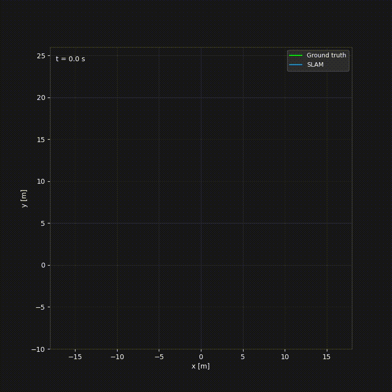
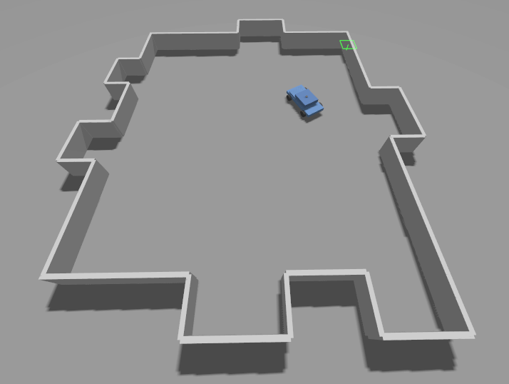
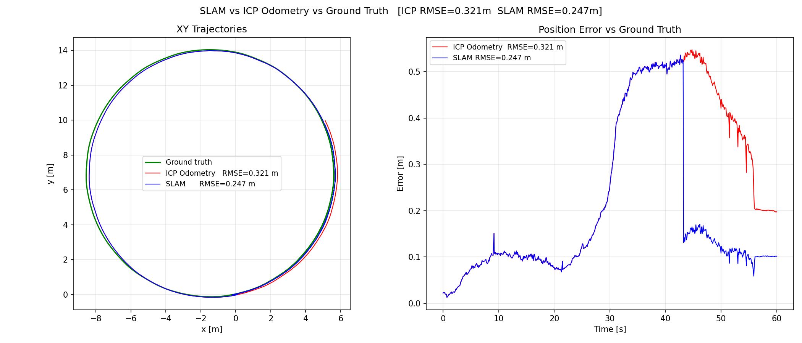

# LiDAR SLAM — ICP Odometry, Scan Context Loop Closure, and Pose-Graph Optimisation

A ROS2 Humble C++ implementation of the **full LiDAR SLAM pipeline** following SLAM Handbook
Chapter 8 — *LiDAR SLAM* (Behley, Fallon, Zhao, Kim, Zhang, Zhang & Kim, Cambridge University
Press 2026). A simulated differential-drive car equipped with a VLP-16 style LiDAR drives
through a world of box obstacles, first estimating its pose via scan-to-scan ICP odometry
(§8.2), then correcting the accumulated drift with Scan Context loop closure detection (§8.3.2.2)
and Gauss-Newton pose-graph optimisation (§8.4.2).

**Zero PCL dependency.** Voxel grid, normal estimation, Scan Context, and the pose-graph solver
are all implemented from scratch in Eigen. The KD-tree uses the vendored nanoflann single-header
library.

---

## Demo

**SLAM animation** — ground truth (green), SLAM path (blue), accumulated point cloud map (light blue):



**Simulation world:**



**Trajectory comparison and RMSE analysis** — ICP odometry (red) vs SLAM (blue) vs ground truth (green), with loop closure marker:



---

## Table of Contents

1. [Overview](#1-overview)
2. [Mathematical Background](#2-mathematical-background)
3. [ICP Odometry](#3-icp-odometry)
    - [3.1 The Scan Registration Problem](#31-the-scan-registration-problem)
    - [3.2 Voxel Grid Downsampling](#32-voxel-grid-downsampling)
    - [3.3 Normal Estimation via PCA](#33-normal-estimation-via-pca)
    - [3.4 KD-tree Nearest-Neighbour Search](#34-kd-tree-nearest-neighbour-search)
    - [3.5 Point-to-Plane ICP — Linearised System](#35-point-to-plane-icp--linearised-system)
    - [3.6 Convergence Criteria](#36-convergence-criteria)
    - [3.7 Pose Accumulation on SE(3)](#37-pose-accumulation-on-se3)
    - [3.8 Drift Analysis](#38-drift-analysis)
4. [Loop Closure Detection](#4-loop-closure-detection)
    - [4.1 Keyframe Selection](#41-keyframe-selection)
    - [4.2 Scan Context Descriptor](#42-scan-context-descriptor)
    - [4.3 Loop Closure Detection Pipeline](#43-loop-closure-detection-pipeline)
5. [Pose Graph Optimisation](#5-pose-graph-optimisation)
    - [5.1 Pose Graph Construction](#51-pose-graph-construction)
    - [5.2 Pose-Graph Optimisation — Gauss-Newton on SE(3)](#52-pose-graph-optimisation--gauss-newton-on-se3)
    - [5.3 Inter-Keyframe Pose Continuity](#53-inter-keyframe-pose-continuity)
6. [Simulation Architecture](#6-simulation-architecture)
7. [Running the Simulation](#7-running-the-simulation)
8. [Tuning Guide](#8-tuning-guide)
- [Appendix A — Derivation of the Point-to-Plane Linear System](#appendix-a--derivation-of-the-point-to-plane-linear-system)
- [Appendix B — Normal Estimation: PCA Convergence and Sign Disambiguation](#appendix-b--normal-estimation-pca-convergence-and-sign-disambiguation)
- [Appendix C — Voxel Grid Hash Function](#appendix-c--voxel-grid-hash-function)
- [Appendix D — Scan Context: Ring-Key and Column-Shifted Cosine Distance](#appendix-d--scan-context-ring-key-and-column-shifted-cosine-distance)
- [Appendix E — SE(3) Adjoint](#appendix-e--se3-adjoint)
- [Appendix F — Gauss-Newton PGO: Full Jacobian Derivation](#appendix-f--gauss-newton-pgo-full-jacobian-derivation)

---

## 1. Overview

### Three-component architecture

```
┌──────────────────────────┐
│  ICP Odometry            │  scan-to-scan registration → T_world_raw ∈ SE(3)
│  (Handbook §8.2)         │  drifts as O(√n) over n scans
└────────────┬─────────────┘
             │ new keyframe every ~1.5 m / ~17°
             ▼
┌──────────────────────────┐
│  Loop Closure            │  Scan Context place recognition
│  (Handbook §8.3)         │  ring-key → SC cosine → ICP verify → edge added
└────────────┬─────────────┘
             │ loop-closure edge added to graph
             ▼
┌──────────────────────────┐
│  Pose-Graph Opt.         │  Gauss-Newton on SE(3)
│  (Handbook §8.4)         │  corrects all keyframe poses simultaneously
└────────────┬─────────────┘
             ▼
  corrected pose on /slam/odom
```

---

### Step 1 — ICP odometry (runs on every scan)

*Iterative Closest Point* (ICP) is the foundational algorithm for scan registration
(Besl & McKay 1992 \[3\]; Chen & Medioni 1992 \[4\]). At 10 Hz the LiDAR produces a new
point cloud. ICP aligns it against the previous scan to find ΔT — the small relative motion
the robot made between the two scans. ΔT is then composed onto the running world pose to keep
the absolute pose estimate up to date.

Each individual ΔT is accurate. The problem is that small errors compound: after chaining
hundreds of ΔTs the pose has drifted — the SLAM Handbook (§8.2.3) reports ~1 m of drift per
1 000 m travelled for well-tuned systems.

**Per-scan pipeline:**

1. **Parse point cloud** ([README §3.1](#31-the-scan-registration-problem))
   - `PointCloud2` stores LiDAR data as a flat byte buffer
   - `PointCloud2ConstIterator` walks the buffer extracting the `"x"`, `"y"`, `"z"` fields into an `Eigen::Vector3d` per point
   - NaN points (beams with no return) and ground returns (z below threshold) are filtered out
   - `std::vector<Vector3d>` (~11 500 filtered points)

2. **Voxel grid downsample** ([README §3.2](#32-voxel-grid-downsampling))
   - Divide 3D space into a regular grid of cubes (voxels) of side length L=0.3 m
   - For each cube that contains at least one point, discard all points inside it and replace them with a single point at their average position (centroid)
   - Empty cubes are ignored
   - `std::vector<Vector3d>` (~400–800 evenly spaced representative points)

3. **Estimate normals on the target scan** — the target is the previous scan, held fixed as the reference; the source is the current (newest) scan that will be aligned onto it. For each target point **q_i** ([README §3.3](#33-normal-estimation-via-pca)):
   - **k-NN** — find the k=20 nearest neighbouring points in the target cloud (using nanoflann KD-tree). This gives a small local patch of points around **q_i**
   - **PCA** — fit a plane to that local patch by computing the covariance matrix of the k neighbours and finding its eigenvectors. The eigenvector corresponding to the smallest eigenvalue points perpendicular to the local surface — that's the surface normal **n_i**
   - `std::vector<PointNormal>` (one unit surface normal **n_i** per target point **q_i**)

4. **Find correspondences** ([README §3.4](#34-kd-tree-nearest-neighbour-search))
   - Transform each source point by the current ΔT: **p_i' = ΔT · p_i** (on the first iteration ΔT = I, so p_i' = p_i)
   - Query the KD-tree to find the nearest target point **q_i** to **p_i'**
   - Each pair carries **n_i** (the normal at **q_i** from step 3)
   - As ΔT improves across iterations, transformed source points land closer to their true positions and correspondences become more accurate
   - → correspondence set $\mathcal{C} = \{(\boldsymbol{p}_i', \boldsymbol{q}_i, \boldsymbol{n}_i)\}$

5. **Solve point-to-plane linear system** ([README §3.5](#35-point-to-plane-icp--linearised-system))
   - For each triple **(p_i', q_i, n_i)** compute the signed distance from **p_i'** to the tangent plane at **q_i**: residual = **n_i · (p_i' − q_i)**
   - Stack all residuals into AᵀA ξ = Aᵀb and solve with LDLT
   - ξ ∈ ℝ⁶ (6-DOF tangent vector: 3 translation + 3 rotation)

6. **Check convergence** ([README §3.6](#36-convergence-criteria))
   - If ‖ξ‖ < ε, max iterations reached, or $\mathcal{C}$ empty: stop and return ΔT
   - Otherwise apply ΔT ← ΔT · Exp(ξ) and repeat from step 4
   - ΔT ∈ SE(3) + RMSE scalar $\sqrt{\frac{1}{N}\sum_i(\boldsymbol{n}_i^\top(\boldsymbol{p}_i'-\boldsymbol{q}_i))^2}$ measuring final scan alignment quality
   - For odometry ICP the RMSE is returned but not used as a gate; for loop closure ICP it is used as a hard rejection threshold — candidates with RMSE > 0.08 m are discarded ([README §4.3](#43-loop-closure-detection-pipeline) Stage 3a)

7. **Accumulate pose** ([README §3.7](#37-pose-accumulation-on-se3))
   - Right-compose ΔT onto the running world pose and renormalise SO(3)
   - $\boldsymbol{T}_\text{world} \in SE(3)$ (updated absolute pose estimate)

---

### Step 2 — Keyframes and the pose graph

Not every scan needs to be stored. Instead a **keyframe** is created only when the robot has
moved far enough since the last one (here: 1.5 m or 17° of rotation).

**Each node stores:**

- **Absolute pose** $\boldsymbol{T}_i \in SE(3)$ — where the robot was in the world when this keyframe was taken. This is what PGO corrects.
- **Point cloud** — the downsampled LiDAR scan in the sensor frame, kept so that ICP can be run against it later during loop closure verification.
- **Scan Context descriptor** — the polar-grid height matrix described in Step 3, used to recognise if a future keyframe sees the same place.

**Each edge stores:**

- **Relative transform** $\boldsymbol{T}_{ij} \in SE(3)$ — the measured motion from node $i$ to node $j$, computed as $\boldsymbol{T}_i^{-1} \cdot \boldsymbol{T}_j$. For loop closure edges it comes from ICP run between the two loop closure keyframe point clouds.
- **Information matrix** $\boldsymbol{\Omega}_{ij}$ — a $6 \times 6$ weight matrix expressing how much to trust this edge. Odometry edges use $\boldsymbol{\Omega} = 100 \cdot \boldsymbol{I}_6$; loop closure edges use $\boldsymbol{\Omega} = 500 \cdot \boldsymbol{I}_6$. The rationale of the weights are explained later on.

---

### Step 3 — Loop closure detection

When a new keyframe KF_i is added, the system checks whether the robot has returned to a
previously visited place. Detection runs as a four-stage pipeline, each stage acting as a gate:

- **Stages 1 & 2 — Scan Context descriptor matching** (Handbook §8.3.2.2): The Scan Context
  descriptor is a bird's-eye-view polar grid where each cell records the maximum height of any
  point in that direction and range bin — a fingerprint of the spatial arrangement of obstacles.
  Stage 1 uses a compact ring-key summary for fast pre-filtering; Stage 2 computes the full
  cosine distance between descriptors.
- **Stage 3a — ICP geometric verification** (Handbook §8.4.1): ICP is run directly between the
  two stored keyframe point clouds. A low RMSE confirms the scans genuinely overlap.
- **Stage 3b — Cycle consistency** (Handbook §3.2.2 eq. 3.6): The ICP result is checked for
  geometric consistency with the existing odometry chain to reject perceptual aliases that passed
  Stage 3a with a low RMSE despite being false positives.

```
  new keyframe KF_i
          │
          ▼
  ╔══════════════════════════════════════════════════════╗
  ║  Scan Context descriptor matching                    ║  (Handbook §8.3.2.2, README §4.2)
  ║                                                      ║
  ║  ┌────────────────────────────────────────────────┐  ║
  ║  │ Stage 1 — ring-key pre-filter                  ├──╫──> > threshold: not a LC candidate
  ║  └──────────────────┬─────────────────────────────┘  ║
  ║                     │ ≤ threshold                     ║
  ║                     ▼                                 ║
  ║  ┌────────────────────────────────────────────────┐  ║
  ║  │ Stage 2 — SC cosine distance                   ├──╫──> > threshold: not a LC candidate
  ║  └──────────────────┬─────────────────────────────┘  ║
  ╚═════════════════════╪════════════════════════════════╝
                        │ ≤ threshold
                        ▼
  ┌──────────────────────────────────────────────────────┐
  │  Stage 3a — ICP RMSE check                           ├──> RMSE > 0.08 m: reject
  │  (Handbook §8.4.1, README §4.3)                      │
  └──────────────────────┬───────────────────────────────┘
                         │ RMSE ≤ 0.08 m
                         ▼
  ┌──────────────────────────────────────────────────────┐
  │  Stage 3b — Cycle consistency                        ├──> t_err>5m or R_err>0.8rad: reject
  │  (Handbook §3.2.2 eq. 3.6, README §4.3)              │
  └──────────────────────┬───────────────────────────────┘
                         │ both within threshold
                         ▼
          add loop closure edge (j → i)
          T_ji ← relative transform from ICP
          Ω    = 500·I₆
```

> Full derivations: [README §4.2](#42-scan-context-descriptor) (ring-key and SC distance), [README §4.3](#43-loop-closure-detection-pipeline) (ICP RMSE and cycle consistency rejection).

After a loop closure is added the graph gains an additional edge:

```
[KF0] ──odom──> [KF1] ──odom──> ... ──odom──> [KF22]
  │                                               │
  └─────────────── loop closure ─────────────────┘
          (Ω = 500, large residual due to drift)
```

The loop closure edge stores the ICP-measured relative transform between KF0 and KF22. Its
residual is large — because the accumulated drift means the current node poses say KF22 is
far from KF0, while the loop closure edge says they should be close. This contradiction is
what PGO resolves.

---

### Step 4 — Pose graph optimisation (PGO)

**The problem PGO needs to solve:**

The residual for any edge is:

$$\boldsymbol{e}_{ij} = \text{Log}(\boldsymbol{T}_{ij}^{-1} \boldsymbol{T}_i^{-1} \boldsymbol{T}_j)$$

where $\boldsymbol{T}_{ij}$ is the fixed measured transform stored on the edge and
$\boldsymbol{T}_i^{-1} \boldsymbol{T}_j$ is the predicted relative transform recomputed from the
current node poses each iteration.

**Odometry edges** — $\boldsymbol{T}_{ij}$ was constructed as $\boldsymbol{T}_i^{-1} \cdot \boldsymbol{T}_j$
at the moment the keyframe was added, so the measured and predicted transforms are identical
by construction:

$$\boldsymbol{T}_{ij}^{-1} \boldsymbol{T}_i^{-1} \boldsymbol{T}_j
  = (\boldsymbol{T}_i^{-1} \boldsymbol{T}_j)^{-1}(\boldsymbol{T}_i^{-1} \boldsymbol{T}_j)
  = \boldsymbol{I}
\quad\Rightarrow\quad \boldsymbol{e}_{ij} = \text{Log}(\boldsymbol{I}) = \boldsymbol{0}$$

**Loop closure edge** — $\boldsymbol{T}_{ij}$ (= $\Delta\boldsymbol{T}_\text{LC}$) comes from ICP run
directly between the two stored keyframe point clouds — a geometric measurement independent
of the node poses. But $\boldsymbol{T}_i^{-1} \boldsymbol{T}_j$ uses the current node poses, which
have accumulated drift across all 22 odometry steps between KF0 and KF22. These two disagree:

$$\boldsymbol{T}_{ij}^{-1} \boldsymbol{T}_i^{-1} \boldsymbol{T}_j \neq \boldsymbol{I}
\quad\Rightarrow\quad \boldsymbol{e}_{ij} \neq \boldsymbol{0} \quad\text{(large — driven by accumulated drift)}$$

**PGO optimization cost function:**

Every edge's residual is squared, weighted by its information matrix, and summed. Loop closure
edges (weight 500) contribute more than odometry edges (weight 100), so PGO works harder to
satisfy them. The full cost function and its Gauss-Newton solution are derived in [README §5.2](#52-pose-graph-optimisation--gauss-newton-on-se3).


---

### Step 5 — From poses to localization and mapping

Once PGO has corrected the node poses, **localization** is simply reading off the corrected
pose for the current keyframe.

**Mapping** falls out almost for free: each keyframe stored its point cloud in the sensor
frame. To build a 3D map, transform each keyframe's point cloud into the world frame using
its corrected pose and merge them all. The accuracy of the map depends entirely on the
accuracy of the poses — with raw drift, the same physical wall seen at KF0 and KF22 produces
two slightly offset copies in the map (blurry). After PGO they land on top of each other
(sharp).

This is why localization and mapping are inherently **coupled**: you need accurate poses to
build a good map, but you need a recognisable place descriptor (Scan Context) to detect loop
closures and correct the poses. SLAM solves both simultaneously — the pose graph is the sparse
backbone of the map, and each PGO run sharpens both.

> **What this package outputs.** Corrected poses on `/slam/odom`; raw drifting trajectory on
> `/icp/odom`. A dense merged point cloud is not explicitly produced — the focus is on the
> pose-graph pipeline. Feeding the corrected keyframe poses and stored point clouds into a
> voxel grid or occupancy map is a straightforward next step (the architecture of systems like
> LIO-SAM, Cartographer, and KISS-ICP).

> **Notation:** This document follows the conventions of the
> [SLAM Handbook](https://github.com/SLAM-Handbook-contributors/slam-handbook-public-release)
> (Cambridge University Press). See also the `ekf_se3_localization` README §2 for a full
> derivation of the SE(3) Lie group machinery used here.

---

## 2. Mathematical Background

### Notation Legend

| Symbol | Meaning |
|--------|---------|
| $\mathrm{P} = \{\boldsymbol{p}_i \in \mathbb{R}^3\}$ | Source point cloud (current scan) |
| $\mathrm{Q} = \{\boldsymbol{q}_i \in \mathbb{R}^3\}$ | Target point cloud (previous scan) |
| $\boldsymbol{n}_i \in \mathbb{R}^3$ | Unit surface normal at target point $\boldsymbol{q}_i$ |
| $\Delta\boldsymbol{T} \in SE(3)$ | Relative transform aligning $\mathrm{P} \to \mathrm{Q}$ |
| $\Delta\boldsymbol{R} \in SO(3)$ | Rotation part of $\Delta\boldsymbol{T}$ |
| $\Delta\boldsymbol{t} \in \mathbb{R}^3$ | Translation part of $\Delta\boldsymbol{T}$ |
| $\boldsymbol{\xi} = [\Delta\boldsymbol{t}; \boldsymbol{\theta}] \in \mathbb{R}^6$ | Tangent vector (Sophus ordering: translation first) |
| $\boldsymbol{\theta}^\wedge$ | Wedge operator: maps $\boldsymbol{\theta} \in \mathbb{R}^3$ to its skew-symmetric matrix; $\boldsymbol{\theta}^\wedge \boldsymbol{v} = \boldsymbol{\theta} \times \boldsymbol{v}$ |
| $\boldsymbol{T}_i$ | Pose of keyframe $i$ in the world frame |
| $\boldsymbol{T}_{ij}$ | Measured relative transform for pose-graph edge $(i \to j)$ |
| $\text{Adj}(\boldsymbol{T})$ | $6\times6$ SE(3) adjoint matrix ([README §5.2](#52-pose-graph-optimisation--gauss-newton-on-se3)) |
| $\boldsymbol{T}_\text{world}$ | Accumulated world pose (raw ICP odometry) |

### SE(3) recap

$SE(3)$ is the group of rigid-body transformations. Composition is matrix multiplication;
the exponential and logarithm maps connect the group to its Lie algebra $se(3) \cong \mathbb{R}^6$:

$$\text{Exp}(\boldsymbol{\xi}) \in SE(3), \qquad \text{Log}(\boldsymbol{T}) \in \mathbb{R}^6$$

In code: `Sophus::SE3d::exp(xi)` and `T.log()`.

For full SE(3) background see `ekf_se3_localization/README.md §2`.

### Wedge operator $(\cdot)^\wedge$

The SLAM Handbook (Notation, page xv) defines $(\cdot)^\wedge$ as the operator that maps
$\boldsymbol{a} \in \mathbb{R}^3$ to its skew-symmetric matrix, implementing the cross product:
$\boldsymbol{a}^\wedge \boldsymbol{b} = \boldsymbol{a} \times \boldsymbol{b}$.

$$
\boldsymbol{a}^\wedge = \begin{bmatrix} 0 & -a_z & a_y \\ a_z & 0 & -a_x \\ -a_y & a_x & 0 \end{bmatrix}
$$

The inverse operator $(\cdot)^\vee$ extracts the vector back from a skew-symmetric matrix.
This notation appears throughout the point-to-plane Jacobian derivation (Appendix A) and the
pose-graph Jacobians (Appendix F).

---

## 3. ICP Odometry

### 3.1 The Scan Registration Problem

### Problem statement (SLAM Handbook eq. 8.1)

Given source $\mathrm{P}$ and target $\mathrm{Q}$, find the rigid transform:

$$
\Delta\boldsymbol{T}^* = \arg\min_{\Delta\boldsymbol{R} \in SO(3),\, \Delta\boldsymbol{t} \in \mathbb{R}^3}
\sum_{(\boldsymbol{p},\boldsymbol{q}) \in \mathrm{C}} d\!\left(\boldsymbol{q},\; \Delta\boldsymbol{R}\,\boldsymbol{p} + \Delta\boldsymbol{t}\right)^2
$$

where $\mathrm{C} = \{(\boldsymbol{p}, \boldsymbol{q}) \mid \boldsymbol{p} \in \mathrm{P},\, \boldsymbol{q} \in \mathrm{Q}\}$ is the correspondence set and $d(\cdot)$ is a distance metric. (eq. 1)

### Distance metrics (SLAM Handbook §8.2.1.1, Figure 8.3)

Three metrics are standard in LiDAR SLAM:

| Metric | Distance $d(\boldsymbol{q}, \Delta\boldsymbol{R}\boldsymbol{p} + \Delta\boldsymbol{t})$ | Properties |
|--------|---------|-----------|
| **Point-to-point** | $\lVert\Delta\boldsymbol{R}\boldsymbol{p} + \Delta\boldsymbol{t} - \boldsymbol{q}\rVert_2$ | Simple; sensitive to noise on flat surfaces |
| **Point-to-line** | Distance from transformed $\boldsymbol{p}$ to line through $\boldsymbol{q}$ | Good for structured environments with linear features |
| **Point-to-plane** | $\lvert\boldsymbol{n}^\top(\Delta\boldsymbol{R}\boldsymbol{p} + \Delta\boldsymbol{t} - \boldsymbol{q})\rvert$ | Fast convergence on planar surfaces; this implementation |

The point-to-plane metric measures the *signed distance from the transformed source point to
the local tangent plane at the matched target point*. It constrains motion along the surface
normal direction and is insensitive to sliding along the surface — which matches the physics
of LiDAR returns from planar walls and ground.

### The ICP iteration

Because the correspondence set $\mathrm{C}$ depends on the current transform estimate (we use
the nearest neighbour under the current $\Delta\boldsymbol{T}$), and the optimal transform depends on $\mathrm{C}$,
ICP alternates between the two steps until convergence:

$$\mathrm{C}^k = \left\lbrace \left(\boldsymbol{p},\; \arg\min_{\boldsymbol{q}' \in \mathrm{Q}}
\left\lVert\boldsymbol{p} - (\boldsymbol{R}^{k-1}\boldsymbol{q}' + \boldsymbol{t}^{k-1})\right\rVert_2 \right) \;\middle|\; \boldsymbol{p} \in \mathrm{P} \right\rbrace$$

---

### 3.2 Voxel Grid Downsampling

### Purpose (SLAM Handbook §8.2.1.2)

A raw VLP-16 scan contains $720 \times 16 = 11\,520$ points. Running ICP directly on this density
would require $\sim\!11\,520$ KD-tree queries per iteration $\times$ 50 iterations $= 576\,000$
queries per scan pair at 10 Hz — approximately $5.76 \times 10^6$ queries per second, well
beyond real-time on most CPUs. Downsampling to $\sim\!500$ points with $L = 0.3$ m gives a
$23\times$ speedup while preserving the macroscopic geometry needed for scan registration.

### Algorithm

Partition 3D space into an axis-aligned grid of voxels with side length $L$. Each point
$\boldsymbol{p}$ maps to the voxel:

$$k_x = \lfloor p_x / L \rfloor, \quad k_y = \lfloor p_y / L \rfloor, \quad k_z = \lfloor p_z / L \rfloor$$

All points in the same voxel are replaced by their **centroid** (the mean), which is the
maximum-likelihood estimator of the voxel's true surface position under isotropic Gaussian noise.

Implemented with `std::unordered_map<VoxelKey, Vector3d>` (see Appendix C for the hash):

```cpp
for (const auto & p : pts) {
    VoxelKey k{ (int)std::floor(p.x()/L),
                (int)std::floor(p.y()/L),
                (int)std::floor(p.z()/L) };
    voxel_sum[k] += p;
    voxel_cnt[k]++;
}
for (const auto & [k, sum] : voxel_sum)
    out.push_back(sum / voxel_cnt[k]);  // centroid
```

One pass over the input: $O(N)$ time, $O(N_\text{voxels})$ memory.

---

### 3.3 Normal Estimation via PCA

Surface normals are required for the point-to-plane distance metric. They are estimated from
the local neighbourhood of each point using Principal Component Analysis (PCA).

### Algorithm (SLAM Handbook §8.2.2.2)

For each point $\boldsymbol{p}$ in the downsampled cloud:

**Step 1 — k nearest neighbours.** Find the $k$ points $\{\boldsymbol{p}_{j}\}_{j=1}^k$ closest to
$\boldsymbol{p}$ using the nanoflann KD-tree ([README §3.4](#34-kd-tree-nearest-neighbour-search)).

**Step 2 — Local covariance.**

$$\bar{\boldsymbol{p}} = \frac{1}{k}\sum_{j=1}^k \boldsymbol{p}_j, \qquad
\boldsymbol{C} = \frac{1}{k}\sum_{j=1}^k (\boldsymbol{p}_j - \bar{\boldsymbol{p}})(\boldsymbol{p}_j - \bar{\boldsymbol{p}})^\top \in \mathbb{R}^{3\times3}$$

**Step 3 — Eigendecomposition.**

$$\boldsymbol{C} = \boldsymbol{V}\boldsymbol{\Lambda}\boldsymbol{V}^\top, \qquad \lambda_1 \le \lambda_2 \le \lambda_3$$

The eigenvector $\boldsymbol{v}_1$ corresponding to the **smallest** eigenvalue $\lambda_1$ spans the
direction of least variation — perpendicular to the local surface. This is the surface normal.

In code:
```cpp
Eigen::SelfAdjointEigenSolver<Matrix3d> solver(C);
Vector3d normal = solver.eigenvectors().col(0);  // col 0 = smallest eigenvalue
```

`SelfAdjointEigenSolver` exploits the symmetry of $\boldsymbol{C}$ and sorts eigenvalues in ascending
order, so column 0 is always the normal direction.

**Step 4 — Sign disambiguation.** The eigenvector direction is ambiguous (both $\boldsymbol{n}$ and
$-\boldsymbol{n}$ are valid). We fix the sign so the normal points *toward the sensor origin* $(0,0,0)$:

$$\text{if}\quad \boldsymbol{n} \cdot (-\boldsymbol{p}) < 0 \quad\Rightarrow\quad \boldsymbol{n} \leftarrow -\boldsymbol{n}$$

See Appendix B for why sign disambiguation is critical for the b-vector in the linear system.

### Effect of $k$

| $k$ | Normal quality | Speed |
|-----|----------------|-------|
| 5–9 | Noisy; $\boldsymbol{C}$ ill-conditioned at edges | Fast |
| **10–20** | **Good; robust to outliers** | **Moderate** |
| 25–40 | Smooth; loses sharp edges | Slow |

Default: $k = 20$.

---

### 3.4 KD-tree Nearest-Neighbour Search

### Why a KD-tree?

Brute-force 1-NN search for $N$ source points against $M$ target points costs $O(NM)$ per
iteration. With $N = M = 500$ and 50 iterations this is $1.25 \times 10^7$ distance computations
per scan — acceptable, but a KD-tree reduces this to $O(N \log M)$, roughly $4\,500$ operations.

### nanoflann

[nanoflann](https://github.com/jlblancoc/nanoflann) is a header-only C++ library for
KD-tree nearest-neighbour search optimised for Eigen-compatible data. It is vendored as a
single file at `include/lidar_icp_odometry/third_party/nanoflann.hpp` — no apt install needed.

The adaptor wraps `std::vector<Vector3d>` so nanoflann can access point coordinates:

```cpp
struct EigenCloud {
    const std::vector<Vector3d> & pts;
    size_t kdtree_get_point_count() const { return pts.size(); }
    double kdtree_get_pt(size_t idx, size_t dim) const { return pts[idx][dim]; }
    template<class BBOX> bool kdtree_get_bbox(BBOX &) const { return false; }
};

using KdTree3d = nanoflann::KDTreeSingleIndexAdaptor<
    nanoflann::L2_Simple_Adaptor<double, EigenCloud>,
    EigenCloud, 3>;
```

**Build once per align() call** ($O(N \log N)$), query once per source point per iteration
($O(\log N)$):

```cpp
EigenCloud cloud{target_pts};
KdTree3d tree(3, cloud, nanoflann::KDTreeSingleIndexAdaptorParams(10));
tree.buildIndex();

// Inside iteration loop:
size_t nn_idx; double nn_sq_dist;
nanoflann::KNNResultSet<double> result(1);
result.init(&nn_idx, &nn_sq_dist);
tree.findNeighbors(result, p_transformed.data(), nanoflann::SearchParameters());
```

---

### 3.5 Point-to-Plane ICP — Linearised System

**Why not point-to-point ICP?** Point-to-point ICP minimises $\sum_i \lVert\Delta\boldsymbol{R}\,\boldsymbol{p}_i + \Delta\boldsymbol{t} - \boldsymbol{q}_i\rVert^2$ and has a clean closed-form solution via SVD (the Kabsch algorithm). It is not used here for two reasons: (1) on walls and ground, many source points map to the same target plane, making the cross-covariance matrix nearly singular; (2) point-to-plane ICP constrains motion along the surface normal, breaking this degeneracy and converging significantly faster in practice (Chen & Medioni 1992 \[4\]).

### Objective

$$
E_{p2n}(\Delta\boldsymbol{R}, \Delta\boldsymbol{t}) = \sum_{i=1}^{N}
\Bigl( \boldsymbol{n}_i^\top \bigl( \Delta\boldsymbol{R}\,\boldsymbol{p}_i + \Delta\boldsymbol{t} - \boldsymbol{q}_i \bigr) \Bigr)^2
$$

This is non-linear in $\Delta\boldsymbol{R}$. For small increments — i.e., after an initial alignment or
when consecutive scans overlap well — we linearise using the small-angle approximation.

### Linearisation

For a small rotation $\boldsymbol{\theta} \in \mathbb{R}^3$:

$$\Delta\boldsymbol{R} \approx \boldsymbol{I} + \boldsymbol{\theta}^\wedge$$

Substituting into the $i$-th residual:

$$r_i = \boldsymbol{n}_i^\top \Bigl( (\boldsymbol{I} + \boldsymbol{\theta}^\wedge)\boldsymbol{p}_i + \Delta\boldsymbol{t} - \boldsymbol{q}_i \Bigr)
      = \boldsymbol{n}_i^\top \boldsymbol{\theta}^\wedge \boldsymbol{p}_i + \boldsymbol{n}_i^\top \Delta\boldsymbol{t} - \boldsymbol{n}_i^\top(\boldsymbol{q}_i - \boldsymbol{p}_i)$$

The key identity (scalar triple product, derived fully in Appendix A):

$$\boldsymbol{n}_i^\top \boldsymbol{\theta}^\wedge \boldsymbol{p}_i = (\boldsymbol{p}_i \times \boldsymbol{n}_i)^\top \boldsymbol{\theta}$$

So:

$$r_i = \underbrace{(\boldsymbol{p}_i \times \boldsymbol{n}_i)^\top}_{\text{rotation}} \boldsymbol{\theta}
       + \underbrace{\boldsymbol{n}_i^\top}_{\text{translation}} \Delta\boldsymbol{t}
       - \boldsymbol{n}_i^\top(\boldsymbol{q}_i - \boldsymbol{p}_i)$$

### Linear system

Stacking all $N$ residuals as $\boldsymbol{r} = \boldsymbol{A}\boldsymbol{\xi} - \boldsymbol{b}$ where
$\boldsymbol{\xi} = [\Delta\boldsymbol{t};\, \boldsymbol{\theta}] \in \mathbb{R}^6$ (translation first,
to match `Sophus::SE3d::exp()`):

$$\boldsymbol{a}_i^\top = \begin{bmatrix} \boldsymbol{n}_i^\top & (\boldsymbol{p}_i \times \boldsymbol{n}_i)^\top \end{bmatrix} \in \mathbb{R}^6, \qquad b_i = \boldsymbol{n}_i^\top(\boldsymbol{q}_i - \boldsymbol{p}_i)$$

The least-squares objective $\min_{\boldsymbol{\xi}} \lVert\boldsymbol{A}\boldsymbol{\xi} - \boldsymbol{b}\rVert^2$ gives the **normal equations**:

$$(\boldsymbol{A}^\top\boldsymbol{A})\,\boldsymbol{\xi} = \boldsymbol{A}^\top\boldsymbol{b}$$

Built incrementally in code as:

```cpp
Matrix6d AtA = Matrix6d::Zero();
Vector6d Atb = Vector6d::Zero();
for (int i = 0; i < N; ++i) {
    Vector6d a;
    a.head<3>() = n_i;            // translation block
    a.tail<3>() = p_i.cross(n_i); // rotation block
    double b_i = n_i.dot(q_i - p_i);
    AtA += a * a.transpose();
    Atb += a * b_i;
}
xi = AtA.ldlt().solve(Atb);
```

### Why LDLT?

$\boldsymbol{A}^\top\boldsymbol{A}$ is symmetric positive semi-definite. LDLT exploits this structure for
speed and numerical stability — the same reason LDLT is used for the Kalman gain solve in
`ekf_se3_localization/src/ekf_se3.cpp`.

### Retraction

After solving, the tangent vector $\boldsymbol{\xi}$ is mapped back to $SE(3)$ via the exponential map:

$$\Delta\boldsymbol{T} \leftarrow \Delta\boldsymbol{T} \cdot \text{Exp}(\boldsymbol{\xi})$$

In code:
```cpp
result.delta_T = result.delta_T * Sophus::SE3d::exp(xi);
result.delta_T.so3().normalize();   // quaternion drift guard (same as ekf_se3.cpp)
```

The `so3().normalize()` call re-projects the internal quaternion onto the unit hypersphere,
preventing floating-point drift from accumulating across iterations.

---

### 3.6 Convergence Criteria

ICP stops when any of these conditions is met:

| Condition | Test | Rationale |
|-----------|------|-----------|
| **Small increment** | $\lVert\boldsymbol{\xi}\rVert_2 < \varepsilon$ | Further iterations would move the pose by less than $\varepsilon$ |
| **Max iterations** | `iter >= max_iterations` | Safety ceiling; prevents infinite loop on degenerate geometry |
| **No correspondences** | `correspondences.empty()` | Source and target clouds have no overlap — ICP cannot proceed |

**Default:** $\varepsilon = 10^{-4}$ (≈ 0.1 mm / 0.006°). The algorithm typically converges in
10–20 iterations for consecutive scans at 1 m/s and 10 Hz (0.1 m between scans).

ICP also returns the point-to-plane RMSE at convergence as an output metric — this is not
used to stop the odometry ICP, but is used as the geometric verification gate during loop
closure ([README §4.3](#43-loop-closure-detection-pipeline)).

---

### 3.7 Pose Accumulation on SE(3)

Each ICP call returns $\Delta\boldsymbol{T} \in SE(3)$ that maps the current scan frame into the
previous scan frame:

$$\Delta\boldsymbol{T} = \boldsymbol{T}_{\text{prev}} \cdot \boldsymbol{T}_{\text{curr}}^{-1} \quad \in SE(3)$$

The world pose is accumulated by right-composition (same convention as `ekf_se3_localization`):

$$\boldsymbol{T}_\text{world}^{(k)} = \boldsymbol{T}_\text{world}^{(k-1)} \cdot \Delta\boldsymbol{T}_k$$

**Why not Euler-angle integration?** Rotation is not a vector space. Adding yaw increments in
$\mathbb{R}^3$ violates the group structure of $SO(3)$ and accumulates significant error for
long trajectories. Right-composition on $SE(3)$ is exact — it stays on the manifold by
construction.

**Quaternion renormalisation.** Each multiplication introduces $O(\varepsilon_\text{mach})$
rounding error in the internal quaternion representation. After each accumulation:

```cpp
T_world_ = T_world_ * result.delta_T;
T_world_.so3().normalize();   // re-project onto unit hypersphere
```

Identical pattern to `ekf_se3_localization/src/ekf_se3.cpp` line 28.

---

### 3.8 Drift Analysis

Without loop closure, ICP odometry drift grows unboundedly. The SLAM Handbook (§8.2.3)
reports that well-tuned 3D LiDAR systems achieve approximately **1 m of drift per 1 000 m**
travelled — which is what motivates the loop closure and pose-graph optimisation in Sections 4
and 5.

---

## 4. Loop Closure Detection

---

### 4.1 Keyframe Selection

Running the full loop-closure search on every LiDAR scan (10 Hz) is unnecessary and expensive.
Instead, a **keyframe** is added to the pose graph whenever the robot has moved more than a
threshold distance or rotated more than a threshold angle since the last keyframe:

$$\text{add keyframe if}\quad \|\Delta\boldsymbol{t}\|_2 \ge d_\text{min} \quad\text{or}\quad \|\text{Log}(\Delta\boldsymbol{R})\|_2 \ge \theta_\text{min}$$

where $\Delta\boldsymbol{T} = \boldsymbol{T}\_{\text{last-kf}}^{-1} \cdot \boldsymbol{T}\_{\text{world-raw}}$ is the
raw motion since the last keyframe.

Each keyframe stores:

| Field | Type | Purpose |
|-------|------|---------|
| `T_world` | `Sophus::SE3d` | Estimated world pose (optimised by PGO after each closure) |
| `pts` | `std::vector<Vector3d>` | Downsampled point cloud in sensor frame (for ICP re-alignment) |
| `normals` | `std::vector<PointNormal>` | Surface normals (for ICP target) |
| `sc_desc` | `Descriptor` (20×60) | Scan Context descriptor (for loop detection) |
| `ring_key` | `RingKey` (20-dim) | Row-means of SC descriptor (for fast pre-filter) |

Defaults: $d_\text{min} = 1.5$ m, $\theta_\text{min} = 0.3$ rad (~17°).

---

### 4.2 Scan Context Descriptor

> **Handbook reference:** Handbook §8.3.2.2

Scan Context \[7\] (Kim & Kim, IROS 2018) is the loop-closure place-recognition method
recommended in the SLAM Handbook (Handbook §8.3.2.2) for ground vehicles with a 3D LiDAR.

#### The BEV polar grid

For each keyframe point cloud, a **bird's-eye-view (BEV) polar grid** is computed:

- Radial dimension: $N_r = 20$ rings, linearly spaced in $[0, R_\text{max}]$ with $R_\text{max} = 20$ m
- Azimuthal dimension: $N_s = 60$ sectors, linearly spaced in $[0, 2\pi)$

Each point $\boldsymbol{p} = (p_x, p_y, p_z)$ maps to:

$$r = \left\lfloor \frac{\sqrt{p_x^2 + p_y^2}}{R_\text{max}} \cdot N_r \right\rfloor, \qquad
s = \left\lfloor \frac{\arctan_2(p_y, p_x) + \pi}{2\pi} \cdot N_s \right\rfloor$$

The cell value $\text{SC}[r][s]$ records the **maximum height** (z-coordinate) of all points
falling in that bin:

$$\text{SC}[r][s] = \max\bigl\lbrace p_z \;\big|\; \text{point} \; \boldsymbol{p} \text{ falls in ring } r, \text{ sector } s \bigr\rbrace$$

Empty cells default to 0. The resulting $20 \times 60$ matrix is the Scan Context descriptor.

In code (`scan_context.cpp`):

```cpp
for (const auto & p : pts) {
    double range = std::sqrt(p.x()*p.x() + p.y()*p.y());
    int r = (int)(range / MAX_RANGE * N_RINGS);
    double az_norm = (std::atan2(p.y(), p.x()) + M_PI) / (2.0 * M_PI);
    int s = (int)(az_norm * N_SECTORS);
    desc(r, s) = std::max(desc(r, s), p.z());   // max-height aggregation
}
```

---

### 4.3 Loop Closure Detection Pipeline

For each newly added keyframe (query, index $q$), the detector searches all keyframes
$0,1,\ldots,q - \delta_\text{gap}$ (where $\delta_\text{gap}$ prevents matching against
very recent neighbours already linked by odometry edges).

**Stage 1 — Ring-key pre-filter** ($O(N_r)$ per candidate):

The **ring key** is the column-wise mean of the SC descriptor — a $N_r$-dimensional vector
summarising the height profile at each radius:

$$\boldsymbol{k}_r = \frac{1}{N_s} \sum_{s=0}^{N_s - 1} \text{SC}[r][s] \in \mathbb{R}^{N_r}$$

It captures the rough structure of the scene without depending on the robot's heading. Two ring
keys are compared with an L1 distance; the candidate is rejected if:

$$\frac{1}{N_r}\sum_{r=0}^{N_r-1} |k_q[r] - k_c[r]| > \tau_\text{rk}$$

Default $\tau_\text{rk} = 0.2$. This $O(N_r)$ check eliminates most candidates before the
more expensive full SC distance is computed.

**Stage 2 — Full SC distance** (top-5 ring-key survivors):

The key insight of Scan Context is that a pure yaw rotation of the robot by $\psi$ radians
shifts all columns of the descriptor by $\lfloor \psi \cdot N_s / (2\pi) \rfloor$ positions.
The **column-shifted cosine distance** finds the shift $s^*$ that best aligns the two
descriptors and reports the minimum distance:

$$d_\text{SC}(\boldsymbol{A}, \boldsymbol{B}) = \min_{s \in \{0,\ldots,N_s-1\}} \;\frac{1}{N_r^\text{valid}(s)} \sum_{r=0}^{N_r-1} \Bigl(1 - \cos\bigl(\boldsymbol{A}[r],\; \text{shift}(\boldsymbol{B},s)[r]\bigr)\Bigr)$$

where $\cos(\boldsymbol{u}, \boldsymbol{v}) = \boldsymbol{u}^\top \boldsymbol{v} / (\lVert\boldsymbol{u}\rVert \lVert\boldsymbol{v}\rVert)$ is the
cosine similarity between two row vectors, and $N_r^\text{valid}(s)$ counts rows where at
least one of the two vectors is non-zero. Values range in $[0, 1]$: $0$ = identical, $1$ = orthogonal.

The best-match shift $s^*$ also seeds the **ICP initial guess**: the query scan is likely
rotated by $\psi_0 = s^* \cdot 2\pi / N_s$ radians relative to the candidate.

$$c^* = \arg\min_{c \in \text{candidates}} d_\text{SC}(\text{SC}_q, \text{SC}_c)$$

Accept as a loop-closure candidate if $d_\text{SC}(c^*) < \tau_\text{SC} = 0.15$.

**Stage 3 — ICP geometric verification and cycle consistency**:

Stage 3 applies two independent rejection criteria. A candidate must pass **both** to become
a loop-closure edge.

#### ICP initial guess

The initial guess is a pure yaw rotation from the SC column shift — zero translation, yaw
$\psi_0 = s^* \cdot 2\pi / N_s$. Translation is left at zero because for a genuine loop
closure the robot has physically returned to near the candidate location, so the two point
clouds are already close in space. Using the odometry chain $\boldsymbol{T}_c^{-1} \cdot \boldsymbol{T}_q$
as the translation component would be counterproductive: it includes all accumulated drift
from the intervening trajectory, which moves the query scan *away* from the candidate rather
than toward it, causing ICP to fail more often.

The SLAM Handbook (§8.4.1) notes that *"geometric priors taken from the existing pose-graph
can be used"* as an initial guess — this applies when the loop is short and drift is small.
For a full-lap loop closure where drift has accumulated significantly, the SC yaw-only guess
is more reliable.

#### 3a — ICP RMSE threshold (Handbook §8.4.1)

The SLAM Handbook (Handbook §8.4.1) states that after place recognition identifies a candidate,
*"fine registration of the corresponding LiDAR scans (typically using ICP)"* is required to
obtain a precise relative transform, and that *"the degree of confidence in a RANSAC-based
alignment for geometric verification"* can be used as a heuristic to reject false positives.
The RMSE threshold below is the concrete implementation of that geometric confidence heuristic.

Say KF_c (candidate) and KF_q (query) are the loop-closure pair under consideration. ICP is
run directly between their stored point clouds. The result is a relative transform
$\Delta\boldsymbol{T}_\text{LC}$ and a point-to-plane RMSE measuring how well the two scans fit
after alignment.

$$\text{RMSE} = \sqrt{\frac{1}{|\mathcal{C}|} \sum_{(\boldsymbol{p},\boldsymbol{q}) \in \mathcal{C}}
\left( \boldsymbol{n}^\top (\Delta\boldsymbol{T}_\text{LC}\,\boldsymbol{p} - \boldsymbol{q}) \right)^2}$$

**Accept** if $\text{RMSE} < \tau_\text{RMSE}$, **reject** otherwise.

A low RMSE means the two point clouds genuinely overlap — the scans look like the same place
and ICP found a tight alignment. A high RMSE means Stages 1 and 2 produced a false positive:
the descriptors looked similar but the actual scans do not fit. Current default: $\tau_\text{RMSE} = 0.08\,\text{m}$.

#### 3b — Cycle consistency check (Handbook §3.2.2, eq. 3.6)

The RMSE threshold alone is insufficient in symmetric environments. **Perceptual aliasing**
occurs when two geometrically distinct locations produce similar scan descriptors — ICP may
converge to a wrong local minimum with a low RMSE because the two scans happen to share a
local planar structure (e.g., two parallel walls of the same length).

The SLAM Handbook (Handbook §3.2.2) addresses this with a **pairwise consistency check**: a proposed
loop closure is trustworthy only if it is geometrically consistent with the existing odometry
chain connecting the same two nodes.

For a loop closure from KF_c to KF_q, define:

$$\boldsymbol{T}_\text{odom} = \boldsymbol{T}_{c}^{-1} \cdot \boldsymbol{T}_{q} \in SE(3)$$

This is the odometry chain estimate of the relative pose between KF_c and KF_q — how far
apart the pose graph currently believes them to be. The ICP result $\Delta\boldsymbol{T}_\text{LC}$
is an independent second estimate of the same quantity. If the loop closure is genuine, these
two should agree up to drift. The **cycle error** measures their disagreement:

$$\boldsymbol{T}_\text{cycle} = \Delta\boldsymbol{T}_\text{LC} \cdot \boldsymbol{T}_\text{odom}^{-1} \in SE(3)$$

When the loop closure is correct, $\boldsymbol{T}_\text{cycle}$ is near-identity — the ICP
transform and the odometry chain say essentially the same thing, differing only by accumulated
drift. When the loop closure is a false positive (ICP converged to a wrong local minimum),
$\boldsymbol{T}_\text{cycle}$ is far from identity regardless of how small the RMSE is.

The check decomposes the cycle error into translation and rotation separately:

$$t_\text{err} = \|\boldsymbol{T}_\text{cycle}.\text{translation}()\|_2 \quad [\text{m}]$$
$$R_\text{err} = \|\text{Log}(\boldsymbol{T}_\text{cycle}.\text{SO3}())\|_2 \quad [\text{rad}]$$

**Accept** if $t_\text{err} < \gamma_t$ **and** $R_\text{err} < \gamma_R$, **reject** otherwise.

**Threshold calibration** (Handbook §3.2.2, footnote 9): *"γ should account for the size of the
loop — longer loops accumulate more noise."* The thresholds are set to approximately
$3\times$ the observed one-lap ICP drift so that genuine closures pass while gross false
positives (typical values: $t_\text{err} \approx 12\,\text{m}$, $R_\text{err} \approx 2.6\,\text{rad}$)
are rejected:

| Parameter | Default | Rationale |
|-----------|---------|-----------|
| `lc_cycle_t_threshold` γ_t | 5.0 m | ≈ 3× observed one-lap translation drift (~1.5 m) |
| `lc_cycle_R_threshold` γ_R | 0.8 rad | ≈ 2× observed one-lap heading drift (~0.35 rad) |

#### Summary — full rejection pipeline

```
ICP(KF_c.pts, KF_q.pts)  →  ΔT_LC, RMSE
        │
        ├─ RMSE > 0.08 m   →  REJECT  (scans don't fit; false positive from SC)
        │
        ├─ t_err > 5.0 m   →  REJECT  (ICP transform contradicts odometry chain)
        │
        ├─ R_err > 0.8 rad →  REJECT  (rotation inconsistent with odometry)
        │
        └─ all passed  →  ACCEPT: add loop-closure edge, ΔT_LC stored as measurement
```

> **Note on repeated traversal.** The SLAM Handbook (Ch. 1, p. 22) notes that
> pose-graph SLAM assumes *"typical mapping scenarios (i.e., not repeatedly traversing
> a small environment)"*. Each additional lap adds more loop closure edges of varying
> quality that collectively degrade previously well-corrected poses. The simulation
> therefore stops automatically after `max_laps` (default 1.3) — one full lap to
> accumulate drift, plus a buffer to ensure the loop closure correction fires before
> the car halts.

The relative transform $\Delta\boldsymbol{T}_\text{LC}$ produced by this ICP call is stored
as the loop-closure edge measurement. The comparison between what the node poses say (KF_c
and KF_q are far apart due to drift) and what the loop-closure edge says (they should be
close) is the residual that PGO resolves in [README §5](#5-pose-graph-optimisation).

---

## 5. Pose Graph Optimisation

### 5.1 Pose Graph Construction

The pose graph is a factor graph with two types of factors:

**Nodes** — keyframe poses $\boldsymbol{T}_0, \boldsymbol{T}_1, \ldots, \boldsymbol{T}_{n-1} \in SE(3)$.

**Odometry edges** — sequential constraints between consecutive keyframes. The measurement
$\boldsymbol{T}_{i \to i+1}$ is the relative motion accumulated from scan-to-scan ICP between the two
keyframes. The new keyframe node pose is then derived by composing the previous pose with this
ICP result — the edges come first, the node poses follow from them.

Information (inverse covariance): $\boldsymbol{\Omega}_\text{odom} = 100 \cdot \boldsymbol{I}_6$ — moderate
precision, roughly $\sigma \approx 0.1$ rad or m per DOF.

**Loop-closure edges** — the relative transform stored on this edge is the ICP result from
Stage 3 between the two keyframe point clouds. Information: $\boldsymbol{\Omega}_\text{LC} = 500 \cdot \boldsymbol{I}_6$.

---

### 5.2 Pose-Graph Optimisation — Gauss-Newton on SE(3)

#### Cost function

Every edge's residual is squared and weighted by its information matrix. The formal cost
function summed over all edges in the graph is:

$$\mathcal{C}(\boldsymbol{T}_0, \ldots, \boldsymbol{T}_{n-1})
= \frac{1}{2} \sum_{(i,j) \in \mathcal{E}}
\boldsymbol{e}_{ij}^\top \; \boldsymbol{\Omega}_{ij} \; \boldsymbol{e}_{ij}$$

where

$$\boldsymbol{e}_{ij} = \text{Log}(\boldsymbol{T}_{ij}^{-1} \boldsymbol{T}_i^{-1} \boldsymbol{T}_j) \in \mathbb{R}^6$$

is the residual 6-vector for edge $(i \to j)$, and $\boldsymbol{\Omega}_{ij}$ is the $6 \times 6$
information (trust) matrix. Higher $\boldsymbol{\Omega}_{ij}$ means that edge contributes more to
the total cost and PGO works harder to reduce its residual.

#### Solving with Gauss-Newton

To minimise $\mathcal{C}$, Gauss-Newton linearises each residual around the current poses. For
each edge $(i \to j)$, perturb node poses by small right-increments
$\delta\boldsymbol{\xi}_i, \delta\boldsymbol{\xi}_j \in \mathbb{R}^6$ and differentiate:

$$\boldsymbol{J}_j = \frac{\partial \boldsymbol{e}_{ij}}{\partial \delta\boldsymbol{\xi}_j} = \boldsymbol{I}_6$$

$$\boldsymbol{J}_i = \frac{\partial \boldsymbol{e}_{ij}}{\partial \delta\boldsymbol{\xi}_i} = -\text{Adj}(\boldsymbol{T}_j^{-1} \boldsymbol{T}_i)$$

$\boldsymbol{J}_j = \boldsymbol{I}_6$ because nudging node $j$ moves the predicted transform
one-for-one. $\boldsymbol{J}_i$ involves the SE(3) Adjoint because node $i$ appears inverted in
the residual — a perturbation to $\boldsymbol{T}_i$ gets rotated and coupled before reaching the
residual (full derivation in Appendix F).

These Jacobians are assembled into the $6n \times 6n$ normal equations — one 6×6 block per
node, non-zero only where nodes share an edge:

$$
\boldsymbol{H} = \sum_{(i,j) \in \mathcal{E}} \begin{bmatrix} \boldsymbol{J}_i^\top \boldsymbol{\Omega}_{ij} \boldsymbol{J}_i & \boldsymbol{J}_i^\top \boldsymbol{\Omega}_{ij} \boldsymbol{J}_j \\ \boldsymbol{J}_j^\top \boldsymbol{\Omega}_{ij} \boldsymbol{J}_i & \boldsymbol{J}_j^\top \boldsymbol{\Omega}_{ij} \boldsymbol{J}_j \end{bmatrix}_{(i,j)}, \qquad \boldsymbol{b} = \sum_{(i,j) \in \mathcal{E}} \begin{bmatrix} \boldsymbol{J}_i^\top \boldsymbol{\Omega}_{ij} \boldsymbol{e}_{ij} \\ \boldsymbol{J}_j^\top \boldsymbol{\Omega}_{ij} \boldsymbol{e}_{ij} \end{bmatrix}_{(i,j)}
$$

$\boldsymbol{H}$ is symmetric positive semi-definite by construction (each term
$\boldsymbol{J}^\top \boldsymbol{\Omega} \boldsymbol{J}$ is PSD because $\boldsymbol{\Omega} > 0$). The linear
system $\boldsymbol{H} \boldsymbol{\delta} = -\boldsymbol{b}$ is therefore solved efficiently with
**LDLT factorisation** — a Cholesky-like decomposition for symmetric PSD matrices:

$$\boldsymbol{\delta} = -\boldsymbol{H}^{-1} \boldsymbol{b} \qquad \text{(computed via LDLT, not matrix inversion)}$$

This gives the correction vector $\boldsymbol{\delta} \in \mathbb{R}^{6n}$ — all node corrections
stacked into one long vector:

$$
\boldsymbol{\delta} = \begin{bmatrix}
\delta\boldsymbol{\xi}_0 \\
\delta\boldsymbol{\xi}_1 \\
\vdots \\
\delta\boldsymbol{\xi}_{n-1}
\end{bmatrix} \in \mathbb{R}^{6n}
$$

where $\delta\boldsymbol{\xi}_k \in \mathbb{R}^6$ is the Lie-algebra correction for node $k$ — the
6-element slice `delta.segment<6>(6*k)` in code. Each node pose is updated by extracting
its own slice and right-composing with its exponential (retraction onto SE(3)):

$$\boldsymbol{T}_k \leftarrow \boldsymbol{T}_k \cdot \text{Exp}(\delta\boldsymbol{\xi}_k), \qquad k = 0, \ldots, n-1$$

The full Gauss-Newton iteration is:

```
repeat:
  1. for each edge: compute e_ij, J_i, J_j
  2. accumulate H and b
  3. add 1e12·I₆ to H[0,0]   ← gauge fix: pins node 0 as the world-frame origin
  4. solve H·δ = −b  via LDLT
  5. retract: T_k ← T_k · Exp(δξ_k) for all k
until ‖δ‖ < tolerance
```

**Why the gauge fix is needed.** $\mathcal{C}$ only depends on relative transforms, so shifting
the entire trajectory by any rigid motion leaves all residuals unchanged — $\boldsymbol{H}$ is
singular without a constraint that fixes the global reference frame. Adding
$10^{12} \cdot \boldsymbol{I}_6$ to node 0's block is not an existing residual; it is a penalty
for moving node 0. Right now that cost is zero. Any nudge $\delta\boldsymbol{\xi}_0 \neq \boldsymbol{0}$
would increase it by $10^{12} \cdot \lVert\delta\boldsymbol{\xi}_0\rVert^2$ — far more than any loop closure
saving could recover — so the optimiser leaves node 0 frozen and routes all corrections through
the remaining nodes.

The loop repeats until $\lVert\boldsymbol{\delta}\rVert_\infty < \varepsilon_\text{PGO}$ (default $10^{-4}$) or
`max_iterations` (default 20) is reached. Each iteration is $O(n + |\mathcal{E}|)$ in the
accumulation phase and $O(n^3)$ in the LDLT solve (dense). For our classroom scenario of
$n \approx 50$–100 nodes this is negligible; production systems use sparse solvers (g2o, GTSAM).

---

### 5.3 Inter-Keyframe Pose Continuity

Applies the most recent PGO correction to non-keyframe scans to maintain smooth
continuity in the TF `odom → base_link` and `/slam/path` between keyframe moments:

$$\boldsymbol{T}_\text{corrected} = \boldsymbol{T}_\text{kf,opt} \cdot \boldsymbol{T}_\text{kf,raw}^{-1} \cdot \boldsymbol{T}_\text{world,raw}$$

where:
- $\boldsymbol{T}_\text{kf,opt}$ — PGO-corrected world pose of the last keyframe
- $\boldsymbol{T}_\text{kf,raw}$ — raw ICP pose recorded when the last keyframe was created
- $\boldsymbol{T}_\text{world,raw}$ — current raw ICP accumulation

---

## 6. Simulation Architecture

### Node graph

Two mutually exclusive operating modes are available, selected by `slam_mode` (see Section 7).

```
                    Gz Fortress (icp_world.sdf — 8 coloured box obstacles)
       ┌──────────────────────────────────────────────────────────────┐
       │  diff_drive_plugin  ──► /odom  (nav_msgs/Odometry)          │
       │  SceneBroadcaster   ──► /world/icp_world/dynamic_pose/info  │
       │  gpu_lidar          ──► /lidar  (Gz PointCloudPacked)       │
       └────────────────────────────────▲─────────────────────────── ┘
                                        │ /cmd_vel (Twist)
                                 ┌──────┴──────┐
                                 │ figure8_node│  circular, 1 m/s, r = 7 m, stops after 1.3 laps
                                 └─────────────┘

── slam_mode:=false (default) ──────────────────────────────────────────────

/lidar/points ──► icp_odometry_node
                      ├── from_ros_msg()      [PointCloud2ConstIterator]
                      ├── voxel_downsample()  [unordered_map, L = 0.3 m]
                      ├── estimate_normals()  [nanoflann k-NN + Eigen PCA]
                      └── IcpSolver::align()  [Eigen LDLT + Sophus]
                              │
                    ┌─────────┴─────────┐
                    ▼                   ▼
               /icp/odom           /icp/path
               TF: odom → base_link

── slam_mode:=true ─────────────────────────────────────────────────────────

/lidar/points ──► slam_node
                      ├── from_ros_msg() + voxel_downsample() + estimate_normals()
                      ├── IcpSolver::align()      [scan-to-scan ICP odometry]
                      │         └──► /icp/odom  (raw, for drift comparison)
                      ├── add_keyframe()           [every ~1.5 m or ~17°]
                      │     ├── ScanContext::compute()   [20×60 BEV descriptor]
                      │     ├── ScanContext::ring_key()  [20-dim summary]
                      │     └── odometry edge added to PoseGraph
                      ├── detect_and_add_loop_closure()
                      │     ├── ring-key L1 pre-filter   [O(20) per candidate]
                      │     ├── SC cosine-shift distance  [top-5 candidates]
                      │     └── ICP geometric verify      [RMSE < 0.3 m]
                      │           └── loop-closure edge added to PoseGraph
                      ├── PoseGraphOptimizer::optimise()  [Gauss-Newton LDLT]
                      └── apply_pgo_correction()
                              │
                    ┌─────────┴──────────┐
                    ▼                    ▼
               /slam/odom           /slam/path
               TF: odom → base_link (corrected)

Gazebo bridge ──► /ground_truth/path ──► RViz (reference)
```

### Topic reference

| Topic | Type | Publisher | Subscriber(s) |
|-------|------|-----------|--------------|
| `/cmd_vel` | `Twist` | `figure8_node` | Gazebo, `figure8_node` |
| `/odom` | `Odometry` | Gazebo | `figure8_node` (velocity feedback) |
| `/lidar/points` | `PointCloud2` | Gazebo (bridged) | `slam_node` |
| `/ground_truth/path` | `Path` | Gazebo bridge | RViz |
| `/icp/odom` | `Odometry` | `slam_node` | `analyze_slam_bag.py` |
| `/slam/odom` | `Odometry` | `slam_node` | `analyze_slam_bag.py` |
| `/slam/path` | `Path` | `slam_node` | RViz |
| `/slam/map` | `PointCloud2` | `slam_node` | RViz |
| TF `odom → base_link` | TF2 | `slam_node` | RViz, TF tree |

---

## 7. Running the Simulation

### Step 1 — Install dependencies

Same as `ekf_se3_localization` — nothing extra.

```bash
sudo apt update
sudo apt install ros-humble-desktop \
                 ros-humble-ros-gz-sim \
                 ros-humble-ros-gz-bridge \
                 ros-humble-sophus \
                 ros-humble-nav-msgs \
                 ros-humble-sensor-msgs \
                 ros-humble-tf2-eigen \
                 python3-colcon-common-extensions
```

### Step 2 — Build

```bash
cd ~/Robotics
source /opt/ros/humble/setup.bash
colcon build --packages-select lidar_icp_odometry \
             --cmake-args -DCMAKE_BUILD_TYPE=RelWithDebInfo
source ~/Robotics/install/setup.bash
```

Expected output:
```
Starting >>> lidar_icp_odometry
Finished <<< lidar_icp_odometry [~30s]
Summary: 1 package finished
```

### Every new terminal — source the workspace

Before running any `ros2` command in a new terminal, source both the ROS underlay
and the built workspace overlay:

```bash
source /opt/ros/humble/setup.bash
source ~/Robotics/install/setup.bash
```

### Step 3 — Mode A: Raw ICP odometry only (§8.2)

```bash
ros2 launch lidar_icp_odometry simulation.launch.py
```

This launches `icp_odometry_node`. After 5 s the car spawns and starts circling at 1 m/s
on a 7 m radius. ICP drift is visible on `/icp/path` after 1–2 laps.

### Step 4 — Mode B: Full LiDAR SLAM (§8.4)

```bash
ros2 launch lidar_icp_odometry simulation.launch.py slam_mode:=true
```

This launches `slam_node` instead. Watch the terminal for:

```
[slam_node] Keyframe 0  pos=(0.00, 0.00, 0.00)
[slam_node] Keyframe 1  pos=(1.52, 0.03, 0.00)
...
[slam_node] SC candidate: query=22  cand=0  sc_dist=0.0821  shift=12
[slam_node] Loop closure verified: cand=0  query=22  RMSE=0.098 m  iter=18
[slam_node] Loop closure at KF 22 → running PGO ...
[slam_node] PGO done in 4 iteration(s)
```

### Step 5 — Visualise in RViz

A pre-configured RViz layout is provided:

```bash
rviz2 -d ~/Robotics/lidar_icp_odometry/config/slam_viz.rviz
```

The config loads three displays (Fixed Frame: `odom`):

| Display | Topic | Colour | Notes |
|---------|-------|--------|-------|
| `Path` | `/ground_truth/path` | Green | Gazebo ground truth |
| `Path` | `/slam/path` | Blue | PGO-corrected trajectory |
| `PointCloud2` | `/slam/map` | Light blue | Merged keyframe map — sharpens after each loop closure |

**Expected behaviour:** The car completes 1.3 laps and stops. The loop closure fires
during the final third of the run, snapping the blue SLAM path back toward ground truth.
The point cloud map sharpens as the corrected poses bring duplicate walls into alignment.

### Step 6 — Record a rosbag and analyse offline

`analyze_slam_bag.py` records `/slam/odom`, `/icp/odom`, and `/ground_truth/odom`,
then produces a trajectory comparison plot and prints RMSE metrics.

**1. Start the simulation** (SLAM mode must be active):

```bash
ros2 launch lidar_icp_odometry simulation.launch.py slam_mode:=true
```

**2. In a second terminal, start recording:**

```bash
ros2 bag record -o icp_sim_bag/slam_run_$(date +%Y%m%d_%H%M%S) /slam/odom /icp/odom /ground_truth/odom /slam/loop_closures /slam/map
```

This creates a timestamped subdirectory inside `icp_sim_bag/` (e.g.
`icp_sim_bag/slam_run_20260531_143022/`) so existing bags in that folder are not
overwritten. The simulation stops automatically after 1.3 laps — recording will end
when the car halts. Stop recording with `Ctrl-C`.

**3. Run the analysis:**

```bash
python3 ~/Robotics/lidar_icp_odometry/scripts/analyze_slam_bag.py icp_sim_bag/slam_run_<timestamp>/
```

Output:
```
Reading: /home/.../icp_sim_bag/slam_run_20260531_143022
Loading /ground_truth/odom ...
Loading /icp/odom ...
Loading /slam/odom ...

  Ground truth : 1243 msgs  t=[12.3 .. 134.7]
  ICP odom     : 1198 msgs  t=[12.4 .. 134.6]
  SLAM odom    : 1198 msgs  t=[12.4 .. 134.6]

  ICP  RMSE vs ground truth : 1.2341 m
  SLAM RMSE vs ground truth : 0.1823 m
  SLAM improved over ICP by  : 85.2%

Plot saved to: slam_run/slam_analysis.png
```

**Topics used:**

| Topic | Type | Source |
|-------|------|--------|
| `/ground_truth/odom` | `nav_msgs/Odometry` | Gazebo via `gz_ground_truth.py` |
| `/icp/odom` | `nav_msgs/Odometry` | Raw scan-to-scan ICP (no loop closure) |
| `/slam/odom` | `nav_msgs/Odometry` | PGO-corrected SLAM pose |
| `/slam/loop_closures` | `std_msgs/Header` | One message per verified loop closure |

**RMSE calculation:**

All three topics are interpolated onto the ICP time axis over the window where all
three overlap. For each sample at time $t$:

$$\text{icp-err}(t) = \sqrt{(x_\text{icp}(t) - x_\text{gt}(t))^2 + (y_\text{icp}(t) - y_\text{gt}(t))^2}$$
$$\text{slam-err}(t) = \sqrt{(x_\text{slam}(t) - x_\text{gt}(t))^2 + (y_\text{slam}(t) - y_\text{gt}(t))^2}$$

RMSE is the root-mean-square of those per-sample errors:

$$\text{ICP RMSE} = \sqrt{\frac{1}{N}\sum_t \text{icp-err}(t)^2}, \qquad \text{SLAM RMSE} = \sqrt{\frac{1}{N}\sum_t \text{slam-err}(t)^2}$$

A lower SLAM RMSE relative to ICP RMSE quantifies how much loop closure and PGO
reduced the accumulated drift.

**Plot panels** (`slam_analysis.png` saved to the bag directory):
- Left: 2-D XY trajectory comparison (ground truth / ICP odometry / SLAM)
- Right: per-sample position error vs ground truth over time, with a vertical orange dashed line marking each loop closure event

### Step 7 — Generate animation video

`animate_slam_bag.py` reads the bag and produces an animated mp4 recreating the RViz
view — ground truth path (green), SLAM path (blue), and accumulated point cloud map
(light blue) — without needing a screen recorder.

```bash
python3 ~/Robotics/lidar_icp_odometry/scripts/animate_slam_bag.py icp_sim_bag/slam_run_<timestamp>/
```

Output: `slam_animation.mp4` saved to the bag directory.

---

## 8. Tuning Guide

### ICP parameters (both modes)

| Parameter | Default | Effect |
|-----------|---------|--------|
| `voxel_leaf_size` | 0.3 m | Smaller → more pts, slower, better normals. Keep 0.2–0.5 m |
| `normal_k_neighbors` | 20 | Larger → smoother normals. Keep 10–30 |
| `max_iterations` | 50 | Rarely hit; reduces if ICP always converges early |
| `convergence_tolerance` | 1e-4 | Tighter → more precise, more iterations |
| `max_correspondence_distance` | 1.0 m | Should be 3–5× `voxel_leaf_size` |

### Keyframe selection (SLAM mode)

| Parameter | Default | Effect |
|-----------|---------|--------|
| `keyframe_min_dist` | 1.5 m | Smaller → denser graph, more LC candidates, slower |
| `keyframe_min_angle` | 0.3 rad | Smaller → more keyframes on turns |

### Loop closure (SLAM mode)

| Parameter | Default | Effect |
|-----------|---------|--------|
| `ring_key_threshold` | 0.2 | Higher → more candidates pass stage 1 (more SC evals) |
| `sc_dist_threshold` | 0.15 | Higher → more loops accepted (risk of false positives) |
| `min_loop_gap` | 20 | Higher → only accept closures further back in time |
| `lc_icp_max_corr_dist` | 1.5 m | Higher → more forgiving ICP for initial yaw errors |
| `lc_icp_rmse_threshold` | 0.08 m | Lower → stricter geometric verification (Handbook §8.4.1, [README §4.3](#43-loop-closure-detection-pipeline) Stage 3a) |
| `lc_cycle_t_threshold` | 5.0 m | Max allowed translation cycle error (Handbook §3.2.2 eq. 3.6, [README §4.3](#43-loop-closure-detection-pipeline) Stage 3b) |
| `lc_cycle_R_threshold` | 0.8 rad | Max allowed rotation cycle error (Handbook §3.2.2 eq. 3.6, [README §4.3](#43-loop-closure-detection-pipeline) Stage 3b) |

### Trajectory generator

| Parameter | Default | Effect |
|-----------|---------|--------|
| `max_laps` | 1.3 | Stop after this many laps. 1.3 gives one full lap of drift accumulation plus a buffer for loop closure to fire before the car halts. Increase to observe repeated-traversal degradation (SLAM Handbook Ch.1 p.22) |

### Failure modes

| Symptom | Likely cause | Fix |
|---------|-------------|-----|
| No loop closures detected | SC distance always > threshold | Lower `sc_dist_threshold`; check world has enough height variation |
| False loop closures (pose jumps) | Perceptual aliasing passing Stage 3 | Tighten `sc_dist_threshold`; lower `lc_icp_rmse_threshold`; tighten `lc_cycle_t_threshold` / `lc_cycle_R_threshold` |
| `/slam/odom` not published | First scan bootstrap | Wait until `/lidar/points` is publishing |
| PGO makes path worse | Wrong loop-closure edge direction | Check ICP RMSE; verify ICP result is plausible |
| Very slow keyframe creation | `keyframe_min_dist` too small | Increase to 2.0 m |
| ICP diverges at loop closure | Poor SC initial guess | Increase `lc_icp_max_corr_dist` and `lc_icp_max_iter` |

---

## References

\[1\] J. Behley, M. Fallon, S. Zhao, G. Kim, J. Zhang, F. Zhang, A. Kim, "LiDAR SLAM,"
*SLAM Handbook*, Chapter 8, Cambridge University Press, 2026.

\[2\] *SLAM Handbook* (Cambridge University Press, 2026). [GitHub](https://github.com/SLAM-Handbook-contributors/slam-handbook-public-release).

\[3\] P. Besl, N. McKay, "A Method for Registration of 3-D Shapes," *IEEE Transactions on Pattern Analysis and Machine Intelligence*, 14(2):239–256, 1992. *(Original ICP paper — point-to-point variant)*

\[4\] Y. Chen, G. Medioni, "Object Modelling by Registration of Multiple Range Images," *Image and Vision Computing*, 10(3):145–155, 1992. *(Introduced point-to-plane ICP)*

\[5\] J. Zhang, S. Singh, "LOAM: Lidar Odometry and Mapping in Real-time," *Robotics: Science and Systems (RSS)*, 2014.

\[6\] W. Xu, Y. Cai, D. He, J. Lin, F. Zhang, "Fast-LIO2: Fast Direct LiDAR-Inertial Odometry," *IEEE Transactions on Robotics*, 38(4):2053–2073, 2022.

\[7\] G. Kim, A. Kim, "Scan Context: Egocentric Spatial Descriptor for Place Recognition within 3D Point Cloud Map," *IEEE/RSJ International Conference on Intelligent Robots and Systems (IROS)*, 2018.

\[8\] J. Solà, J. Deray, D. Atchuthan, "A micro Lie theory for state estimation in robotics," [arXiv:1812.01537](https://arxiv.org/abs/1812.01537), 2021.

---

## Appendix A — Derivation of the Point-to-Plane Linear System

We derive the matrix $\boldsymbol{A}$ row and scalar $b_i$ from first principles.

### Starting point

The $i$-th point-to-plane residual after linearising $\Delta\boldsymbol{R} \approx \boldsymbol{I} + \boldsymbol{\theta}^\wedge$:

$$r_i = \boldsymbol{n}_i^\top \bigl( (\boldsymbol{I} + \boldsymbol{\theta}^\wedge)\boldsymbol{p}_i + \Delta\boldsymbol{t} - \boldsymbol{q}_i \bigr)$$

Expanding:

$$r_i = \underbrace{\boldsymbol{n}_i^\top \boldsymbol{\theta}^\wedge \boldsymbol{p}_i}_{\text{rotation term}}
      + \underbrace{\boldsymbol{n}_i^\top \Delta\boldsymbol{t}}_{\text{translation term}}
      - \underbrace{\boldsymbol{n}_i^\top (\boldsymbol{q}_i - \boldsymbol{p}_i)}_{b_i}$$

### Simplifying the rotation term

We need to show that $\boldsymbol{n}^\top \boldsymbol{\theta}^\wedge \boldsymbol{p} = (\boldsymbol{p} \times \boldsymbol{n})^\top \boldsymbol{\theta}$.

**Step 1:** By definition of the wedge operator: $\boldsymbol{\theta}^\wedge \boldsymbol{p} = \boldsymbol{\theta} \times \boldsymbol{p}$.

**Step 2:** Apply the scalar triple product identity:

$$\boldsymbol{a} \cdot (\boldsymbol{b} \times \boldsymbol{c}) = \boldsymbol{b} \cdot (\boldsymbol{c} \times \boldsymbol{a}) = \boldsymbol{c} \cdot (\boldsymbol{a} \times \boldsymbol{b})$$

with $\boldsymbol{a} = \boldsymbol{n}$, $\boldsymbol{b} = \boldsymbol{\theta}$, $\boldsymbol{c} = \boldsymbol{p}$:

$$\boldsymbol{n}^\top (\boldsymbol{\theta} \times \boldsymbol{p}) = \boldsymbol{\theta}^\top (\boldsymbol{p} \times \boldsymbol{n}) = (\boldsymbol{p} \times \boldsymbol{n})^\top \boldsymbol{\theta}$$

Therefore:

$$\boldsymbol{n}_i^\top \boldsymbol{\theta}^\wedge \boldsymbol{p}_i = (\boldsymbol{p}_i \times \boldsymbol{n}_i)^\top \boldsymbol{\theta}$$

### Assembling row $i$ of $\boldsymbol{A}$

With $\boldsymbol{\xi} = [\Delta\boldsymbol{t};\, \boldsymbol{\theta}]$ (translation first — Sophus ordering):

$$r_i = \underbrace{\begin{bmatrix} \boldsymbol{n}_i^\top & (\boldsymbol{p}_i \times \boldsymbol{n}_i)^\top \end{bmatrix}}_{\boldsymbol{a}_i^\top}\,\boldsymbol{\xi} - b_i, \qquad b_i = \boldsymbol{n}_i^\top (\boldsymbol{q}_i - \boldsymbol{p}_i)$$

### Full system

$$\min_{\boldsymbol{\xi}} \sum_{i=1}^N r_i^2 = \min_{\boldsymbol{\xi}} \|\boldsymbol{A}\boldsymbol{\xi} - \boldsymbol{b}\|^2$$

Normal equations (setting $\partial/\partial\boldsymbol{\xi} = 0$):

$$(\boldsymbol{A}^\top\boldsymbol{A})\,\boldsymbol{\xi} = \boldsymbol{A}^\top\boldsymbol{b}$$

### Rank and degeneracy

$\boldsymbol{A}^\top\boldsymbol{A} \in \mathbb{R}^{6\times6}$ has rank 6 if and only if the normals $\{\boldsymbol{n}_i\}$ span all directions and the source points $\{\boldsymbol{p}_i\}$ are not all coplanar.

**Degenerate case:** if all points lie on a single horizontal plane, all normals are vertical
($\boldsymbol{n}_i = [0,0,1]^\top$). Then the cross products $\boldsymbol{p}_i \times \boldsymbol{n}_i$ all
lie in the $xy$-plane, and the system has rank ≤ 5 — vertical translation is unobservable.
This is why the box obstacles in `icp_world.sdf` are oriented at different yaw angles: to
provide normal diversity in all three dimensions.

### Sophus ordering note

`Sophus::SE3d::exp(xi)` with a `Matrix<double,6,1>` uses:
- `xi.head<3>()` = translation $\boldsymbol{\rho}$
- `xi.tail<3>()` = rotation $\boldsymbol{\theta}$

Our $\boldsymbol{A}$ row $[\boldsymbol{n}_i^\top,\, (\boldsymbol{p}_i\times\boldsymbol{n}_i)^\top]$ with
$\boldsymbol{\xi} = [\Delta\boldsymbol{t};\,\boldsymbol{\theta}]$ matches this ordering exactly.

---

## Appendix B — Normal Estimation: PCA Convergence and Sign Disambiguation

### Why PCA gives the normal

Points on a locally smooth surface at point $\boldsymbol{p}$ span a 2D tangent plane. Their
deviations from the centroid $\bar{\boldsymbol{p}}$ lie primarily in this plane, so:

- The **two largest** eigenvalues of $\boldsymbol{C}$ correspond to eigenvectors spanning the tangent plane.
- The **smallest** eigenvalue corresponds to the direction of least variation — the surface normal.

Formally, $\boldsymbol{C}$ is the empirical covariance of a 3D point distribution. For a perfect
planar patch, $\lambda_1 = 0$ and the corresponding eigenvector is exactly the plane normal.
For a noisy sample, $\lambda_1 \approx \sigma_\text{range}^2 / k$ (the noise variance divided
by the number of neighbours).

### Degeneracy condition

If $\lambda_1 / \lambda_2 > 0.9$, the local neighbourhood is isotropic (a sphere of points)
and the normal direction is undefined. In this implementation such degenerate points still
produce a normal, but it will be unreliable. For production use, filter out points where
$\lambda_1 / \lambda_2 > 0.8$ before running ICP.

### Sign disambiguation — why it matters

Consider a source point $\boldsymbol{p}$ matched to a target point $\boldsymbol{q}$ with normal $\boldsymbol{n}$.
The $b$-vector entry is:

$$b_i = \boldsymbol{n}_i^\top (\boldsymbol{q}_i - \boldsymbol{p}_i)$$

If $\boldsymbol{n}_i$ has the wrong sign, $b_i$ flips sign, and the solver pushes the transform
in the **wrong direction** — accelerating divergence rather than convergence.

The sensor-viewpoint rule (flip if $\boldsymbol{n} \cdot (-\boldsymbol{p}) < 0$) ensures that all normals
consistently point toward the sensor, making $b_i$ positive when the source point is on the
near side of the target surface — the physically correct direction for the correction.

---

## Appendix C — Voxel Grid Hash Function

The voxel key `(x, y, z)` maps to a `size_t` hash using a Boost-style XOR combination:

```cpp
struct VoxelKeyHash {
    size_t operator()(const VoxelKey & k) const {
        size_t h = 0;
        auto combine = [&](int v) {
            h ^= std::hash<int>{}(v) + 0x9e3779b9u + (h << 6) + (h >> 2);
        };
        combine(k.x);
        combine(k.y);
        combine(k.z);
        return h;
    }
};
```

The magic constant $\varphi = \texttt{0x9e3779b9}$ is the 32-bit approximation of $2^{32} / \phi$
where $\phi = (1 + \sqrt{5}) / 2$ is the golden ratio. This spreads the bits of each integer
coordinate uniformly across the hash, minimising collisions for spatial data even when
coordinates are highly correlated (e.g., many points in the same x-slab).

The shift-and-XOR pattern `h ^ (h << 6) ^ (h >> 2)` mixes the previous hash value with
the new one, ensuring that the order of combine() calls matters and that two keys differing
only in one coordinate produce very different hashes.

---

## Appendix D — Scan Context: Ring-Key and Column-Shifted Cosine Distance

### Ring-key distance

The ring key $\boldsymbol{k} = (k_0, \ldots, k_{N_r-1})^\top$ with $k_r = \frac{1}{N_s}\sum_s \text{SC}[r][s]$
is the mean height at each radius. Two scans taken at very different locations will have
different height profiles even after averaging over all azimuths, making the ring-key distance
a useful discriminator.

The L1 ring-key distance:

$$d_\text{rk}(\boldsymbol{k}_q, \boldsymbol{k}_c) = \frac{1}{N_r}\sum_{r=0}^{N_r-1} |k_q[r] - k_c[r]|$$

is in the same unit as the descriptor cell values (metres of height). Values below
$\tau_\text{rk} = 0.2$ m mean the two scans see similarly structured height profiles at each
radius — a necessary (but not sufficient) condition for a true loop closure.

### Rotation invariance of the full distance

A yaw rotation of angle $\psi$ applied to the sensor:
- shifts all azimuth assignments by $\Delta s = \psi \cdot N_s / (2\pi)$
- cyclically shifts the columns of the SC descriptor by $\Delta s$

Therefore, if two scans $\boldsymbol{A}$ and $\boldsymbol{B}$ were taken at the same location but with a
yaw offset of $\psi$, then there exists an integer shift $s^* = \lfloor \Delta s \rceil$ such that
$\text{shift}(\boldsymbol{B}, s^*)$ nearly matches $\boldsymbol{A}$ column-by-column. The column-shifted
cosine distance finds this optimal shift by exhaustive search over all $N_s = 60$ possibilities.

**Why cosine similarity?** The dot product is a natural measure of pattern similarity when
vectors are non-negative (which SC descriptor rows are, since cell values are heights $\geq 0$
for ground-based vehicles). Normalising by the norms gives a scale-invariant measure: a
scene observed at close range (tall cells) and at long range (short cells) still produces the
same cosine similarity if the spatial pattern is the same.

### Computational cost

For one query against one candidate:
- Ring-key L1: $O(N_r) = O(20)$ — fast pre-filter
- Full SC distance: $O(N_r \cdot N_s^2) = O(20 \times 3600) = O(72\,000)$ — affordable for top-5 candidates

Against a database of $K$ candidates: $O(K \cdot N_r)$ for ring-key, $O(5 \cdot N_r \cdot N_s^2)$
for full distance — both are real-time at typical keyframe rates.

---

## Appendix E — SE(3) Adjoint

### Definition

For $\boldsymbol{T} \in SE(3)$ and $\boldsymbol{\xi} \in \mathbb{R}^6$, the adjoint $\text{Adj}(\boldsymbol{T})$ is
defined by the conjugation property:

$$\boldsymbol{T} \cdot \text{Exp}(\boldsymbol{\xi}) \cdot \boldsymbol{T}^{-1} = \text{Exp}\!\bigl(\text{Adj}(\boldsymbol{T})\, \boldsymbol{\xi}\bigr)$$

It maps a tangent vector expressed at the identity (Lie algebra element) to the corresponding
tangent vector in the local frame of $\boldsymbol{T}$.

### Derivation in Sophus translation-first ordering

Let $\boldsymbol{T} = (\boldsymbol{R}, \boldsymbol{t})$ and $\boldsymbol{\xi} = [\boldsymbol{\rho};\, \boldsymbol{\theta}]$ (translation first).

**For infinitesimal $\boldsymbol{\xi}$:**

$$\text{Exp}(\boldsymbol{\xi}) \approx \begin{bmatrix} \boldsymbol{I} + \boldsymbol{\theta}^\wedge & \boldsymbol{\rho} \\ \boldsymbol{0}^\top & 1 \end{bmatrix}, \qquad
\boldsymbol{T} = \begin{bmatrix} \boldsymbol{R} & \boldsymbol{t} \\ \boldsymbol{0}^\top & 1 \end{bmatrix}, \qquad
\boldsymbol{T}^{-1} = \begin{bmatrix} \boldsymbol{R}^\top & -\boldsymbol{R}^\top\boldsymbol{t} \\ \boldsymbol{0}^\top & 1 \end{bmatrix}$$

Compute the conjugation:

$$\boldsymbol{T} \cdot \text{Exp}(\boldsymbol{\xi}) \cdot \boldsymbol{T}^{-1}
\approx \begin{bmatrix} \boldsymbol{I} + \boldsymbol{R}\boldsymbol{\theta}^\wedge\boldsymbol{R}^\top & \boldsymbol{R}\boldsymbol{\rho} + \boldsymbol{t}^\wedge\boldsymbol{R}\boldsymbol{\theta} \\ \boldsymbol{0}^\top & 1 \end{bmatrix}$$

Using the identity $\boldsymbol{R}\boldsymbol{\theta}^\wedge\boldsymbol{R}^\top = (\boldsymbol{R}\boldsymbol{\theta})^\wedge$, this equals
$\text{Exp}(\boldsymbol{\xi}')$ with $\boldsymbol{\xi}' = [\boldsymbol{R}\boldsymbol{\rho} + \boldsymbol{t}^\wedge\boldsymbol{R}\boldsymbol{\theta};\, \boldsymbol{R}\boldsymbol{\theta}]$.

Reading off the $6\times6$ matrix that maps $[\boldsymbol{\rho};\,\boldsymbol{\theta}]$ to $[\boldsymbol{R}\boldsymbol{\rho} + \boldsymbol{t}^\wedge\boldsymbol{R}\boldsymbol{\theta};\, \boldsymbol{R}\boldsymbol{\theta}]$:

$$\text{Adj}(\boldsymbol{T}) = \begin{bmatrix} \boldsymbol{R} & \boldsymbol{t}^\wedge\boldsymbol{R} \\ \boldsymbol{0} & \boldsymbol{R} \end{bmatrix}$$

### Numerical check

For $\boldsymbol{T} = \boldsymbol{I}$: $\text{Adj}(\boldsymbol{I}) = \boldsymbol{I}_6$. ✓

For a pure translation $\boldsymbol{T} = (\boldsymbol{I}, \boldsymbol{t})$:

$$\text{Adj}(\boldsymbol{T}) = \begin{bmatrix} \boldsymbol{I} & \boldsymbol{t}^\wedge \\ \boldsymbol{0} & \boldsymbol{I} \end{bmatrix}$$

This confirms the coupling between rotation of the coordinate frame and translation in the
adjoint: a rotation $\boldsymbol{\theta}$ applied at a point displaced by $\boldsymbol{t}$ induces an
additional linear velocity $\boldsymbol{t}^\wedge \boldsymbol{\theta} = \boldsymbol{t} \times \boldsymbol{\theta}$ at the origin.

---

## Appendix F — Gauss-Newton PGO: Full Jacobian Derivation

We derive $\boldsymbol{J}_j = \boldsymbol{I}_6$ and $\boldsymbol{J}_i = -\text{Adj}(\boldsymbol{T}_j^{-1}\boldsymbol{T}_i)$
from first principles using right perturbation on SE(3).

### Setup

The residual for edge $(i \to j)$ with stored measurement $\boldsymbol{T}_{ij}$ is:

$$\boldsymbol{e}_{ij} = \text{Log}\!\bigl(\boldsymbol{T}_{ij}^{-1} \cdot \boldsymbol{T}_i^{-1} \cdot \boldsymbol{T}_j\bigr) \in \mathbb{R}^6$$

To find how $\boldsymbol{e}_{ij}$ changes when a node pose is nudged, we apply an independent right
perturbation to each node and differentiate. The key identity used throughout is the
**adjoint property**:

$$\text{Exp}(\boldsymbol{\xi}) \cdot \boldsymbol{A} = \boldsymbol{A} \cdot \text{Exp}\!\bigl(\text{Adj}(\boldsymbol{A}^{-1})\,\boldsymbol{\xi}\bigr)$$

which lets us commute an exponential past a fixed transform at the cost of rotating the
tangent vector by $\text{Adj}(\boldsymbol{A}^{-1})$.

---

### Derivation of $\boldsymbol{J}_j$

**Step 1.** Apply a right perturbation $\boldsymbol{\varepsilon}_j \in \mathbb{R}^6$ to node $j$ only
($\boldsymbol{T}_i$ is held fixed):

$$\boldsymbol{T}_j \;\to\; \boldsymbol{T}_j \cdot \text{Exp}(\boldsymbol{\varepsilon}_j)$$

**Step 2.** Substitute into the residual:

$$\boldsymbol{e}_{ij}' = \text{Log}\!\bigl(\boldsymbol{T}_{ij}^{-1} \cdot \boldsymbol{T}_i^{-1} \cdot \boldsymbol{T}_j \cdot \text{Exp}(\boldsymbol{\varepsilon}_j)\bigr)$$

Recognise that $\boldsymbol{T}_{ij}^{-1} \cdot \boldsymbol{T}\_i^{-1} \cdot \boldsymbol{T}\_j = \boldsymbol{T}_{ij}^\text{err}$
(the error pose, equal to $\text{Exp}(\boldsymbol{e}_{ij})$ by definition of Log):

$$\boldsymbol{e}_{ij}' = \text{Log}\!\bigl(\text{Exp}(\boldsymbol{e}_{ij}) \cdot \text{Exp}(\boldsymbol{\varepsilon}_j)\bigr)$$

**Step 3.** Use the first-order BCH approximation
$\text{Log}(\text{Exp}(\boldsymbol{a}) \cdot \text{Exp}(\boldsymbol{b})) \approx \boldsymbol{a} + \boldsymbol{b}$
(valid for small $\boldsymbol{b}$):

$$\boldsymbol{e}_{ij}' \approx \boldsymbol{e}_{ij} + \boldsymbol{\varepsilon}_j$$

**Step 4.** Differentiate with respect to $\boldsymbol{\varepsilon}_j$ at $\boldsymbol{\varepsilon}_j = \boldsymbol{0}$:

$$\boxed{\boldsymbol{J}_j = \frac{\partial \boldsymbol{e}_{ij}'}{\partial \boldsymbol{\varepsilon}_j}\bigg|_{\boldsymbol{\varepsilon}_j=0} = \boldsymbol{I}_6}$$

Nudging node $j$ shifts the predicted relative transform by exactly the same amount —
a one-for-one relationship, hence the identity.

---

### Derivation of $\boldsymbol{J}_i$

**Step 1.** Apply a right perturbation $\boldsymbol{\varepsilon}_i \in \mathbb{R}^6$ to node $i$ only
($\boldsymbol{T}_j$ is held fixed):

$$\boldsymbol{T}_i \;\to\; \boldsymbol{T}_i \cdot \text{Exp}(\boldsymbol{\varepsilon}_i)$$

**Step 2.** Invert the perturbed $\boldsymbol{T}_i$ using
$(\boldsymbol{T}_i \cdot \text{Exp}(\boldsymbol{\varepsilon}_i))^{-1} = \text{Exp}(-\boldsymbol{\varepsilon}_i) \cdot \boldsymbol{T}_i^{-1}$
and substitute:

$$\boldsymbol{e}_{ij}' = \text{Log}\!\bigl(\boldsymbol{T}_{ij}^{-1} \cdot \text{Exp}(-\boldsymbol{\varepsilon}_i) \cdot \boldsymbol{T}_i^{-1} \cdot \boldsymbol{T}_j\bigr)$$

**Step 3.** Use the adjoint property to commute $\text{Exp}(-\boldsymbol{\varepsilon}_i)$ past
$\boldsymbol{T}_i^{-1} \cdot \boldsymbol{T}_j$ (let $\boldsymbol{A} = \boldsymbol{T}_i^{-1} \cdot \boldsymbol{T}_j$):

$$\text{Exp}(-\boldsymbol{\varepsilon}_i) \cdot \boldsymbol{A} = \boldsymbol{A} \cdot \text{Exp}\!\bigl(-\text{Adj}(\boldsymbol{A}^{-1})\,\boldsymbol{\varepsilon}_i\bigr)$$

Substituting $\boldsymbol{A} = \boldsymbol{T}_i^{-1}\boldsymbol{T}_j$ and $\boldsymbol{A}^{-1} = \boldsymbol{T}_j^{-1}\boldsymbol{T}_i$:

$$\boldsymbol{e}_{ij}' = \text{Log}\!\bigl(\boldsymbol{T}_{ij}^{-1} \cdot \boldsymbol{T}_i^{-1} \cdot \boldsymbol{T}_j \cdot \text{Exp}\!\bigl(-\text{Adj}(\boldsymbol{T}_j^{-1}\boldsymbol{T}_i)\,\boldsymbol{\varepsilon}_i\bigr)\bigr)$$

$$= \text{Log}\!\bigl(\text{Exp}(\boldsymbol{e}_{ij}) \cdot \text{Exp}\!\bigl(-\text{Adj}(\boldsymbol{T}_j^{-1}\boldsymbol{T}_i)\,\boldsymbol{\varepsilon}_i\bigr)\bigr)$$

**Step 4.** Apply the first-order BCH approximation again:

$$\boldsymbol{e}_{ij}' \approx \boldsymbol{e}_{ij} - \text{Adj}(\boldsymbol{T}_j^{-1}\boldsymbol{T}_i)\,\boldsymbol{\varepsilon}_i$$

**Step 5.** Differentiate with respect to $\boldsymbol{\varepsilon}_i$ at $\boldsymbol{\varepsilon}_i = \boldsymbol{0}$:

$$\boxed{\boldsymbol{J}_i = \frac{\partial \boldsymbol{e}_{ij}'}{\partial \boldsymbol{\varepsilon}_i}\bigg|_{\boldsymbol{\varepsilon}_i=0} = -\text{Adj}(\boldsymbol{T}_j^{-1}\boldsymbol{T}_i)}$$

Node $i$ appears inverted in the residual. The inverse introduces the Adjoint, which
rotates and couples the perturbation before it reaches the residual — hence a non-trivial
$6\times6$ matrix rather than the identity.

---

### Code

```cpp
const Sophus::SE3d T_pred = Ti.inverse() * Tj;   // T_i^{-1} T_j
const Matrix6d J_j = Matrix6d::Identity();
const Matrix6d J_i = -adjoint(T_pred.inverse()); // -Adj(T_j^{-1} T_i)
```

### Connection to the EKF

Compare with the EKF innovation:

$$\delta\boldsymbol{x} = \boldsymbol{K} \boldsymbol{y}, \qquad \boldsymbol{K} = \boldsymbol{P}\boldsymbol{H}^\top(\boldsymbol{H}\boldsymbol{P}\boldsymbol{H}^\top + \boldsymbol{R})^{-1}$$

The PGO Gauss-Newton step:

$$\delta\boldsymbol{\xi} = -(\boldsymbol{J}^\top\boldsymbol{\Omega}\boldsymbol{J})^{-1}\boldsymbol{J}^\top\boldsymbol{\Omega}\,\boldsymbol{e}$$

is the weighted least-squares solution to the linearised problem — identical in form to the
Kalman correction with $\boldsymbol{J} \leftrightarrow \boldsymbol{H}$, $\boldsymbol{\Omega} \leftrightarrow \boldsymbol{R}^{-1}$,
and the prior term $\boldsymbol{P}^{-1}$ replaced by the accumulated pose-graph prior from adjacent
edges. Both solve the same fundamental problem: fusing a probabilistic prior with a set of
noisy measurements using the minimum-variance linear estimator.
